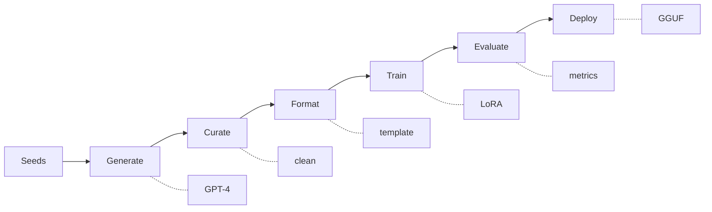

# model-tailor

Fine-tune small language models to match GPT-4 quality at less than 1% of the cost.

GPT-4 costs ~$30/M tokens. For high-volume tasks like SQL generation, email writing, or data extraction, this destroys budgets fast — and GPT-4 is overkill for most of these jobs. model-tailor uses GPT-4 as a **teacher** to generate synthetic training data, then fine-tunes a small 8B model that handles one specific task at a fraction of the cost.

## Pipeline



| Step | Module | What it does |
|------|--------|-------------|
| 1 | `src/generate/` | Synthetic data generation via teacher LLM (seed expansion, self-instruct, evol-instruct) |
| 2 | `src/curate/` | Deduplication, quality filtering, distribution balancing, train/val/test splits |
| 3 | `src/format/` | Convert to instruction-tuning format for Llama, Mistral, or Phi model families |
| 4 | `src/train/` | QLoRA fine-tuning with Unsloth + HuggingFace TRL, dual WandB + MLFlow tracking |
| 5 | `src/evaluate/` | BLEU, ROUGE, execution accuracy, LLM-as-judge, automated benchmarks |
| 6 | `src/deploy/` | Export to GGUF, quantization, FastAPI inference server |

## Prerequisites

Before running the setup script, make sure you have the following installed:

| Requirement | Why | How to check |
|-------------|-----|-------------|
| **Python 3.10+** | Required by the ML libraries (Unsloth, TRL, transformers) | `python3 --version` |
| **Git** | Clone the repository and track changes | `git --version` |
| **NVIDIA GPU + CUDA drivers** | Needed for fine-tuning (Steps 4-6). Generation and curation run on CPU | `nvidia-smi` |
| **An LLM API key** | The teacher model generates your training data. Choose OpenAI, Anthropic, or use Ollama for free local inference | See [Ollama setup](docs/ollama-setup.md) for the free option |

**Windows users**: This project is designed for Linux or WSL2. The auto-activation shell hook requires bash. If you are on Windows, run everything inside WSL2.

**No GPU?** You can still run the generation and curation stages (Steps 1-3) on a CPU-only machine, then move to a GPU instance for training.

## Installation

Clone the repository:

```bash
git clone https://github.com/your-username/model-tailor.git
cd model-tailor
```

Run the setup script:

```bash
chmod +x setup.sh && ./setup.sh
```

The setup script handles the following automatically:

- Creates a `.venv` virtual environment and installs all dependencies
- Installs development tools (pytest, ruff)
- Copies `.env.example` to `.env` if it does not already exist
- Adds an auto-activation hook to `~/.bashrc` so the virtual environment activates whenever you `cd` into the project
- Creates the data directory structure (`data/raw`, `data/curated`, `data/formatted`, `models`, `checkpoints`)
- Checks for GPU availability and warns if VRAM is below 10 GB
- Verifies that all pipeline modules import correctly

Activate the virtual environment:

```bash
source .venv/bin/activate
```

Configure your API keys by editing the `.env` file:

```bash
nano .env
```

| Variable | Required for | Description |
|----------|-------------|-------------|
| `OPENAI_API_KEY` | OpenAI teacher model | Get one at [platform.openai.com](https://platform.openai.com) |
| `WANDB_API_KEY` | Training dashboards | Get one at [wandb.ai](https://wandb.ai) |
| `MLFLOW_TRACKING_URI` | Local experiment tracking | Defaults to `http://localhost:5000` |

For the full list of environment variables, see [docs/configuration.md](docs/configuration.md).

## Quick Validation

After installation, run these three commands to confirm everything is working.

Run the linter and tests:

```bash
make check
```

Verify pipeline imports:

```bash
python3 -c "from src.llm.client import TeacherClient; print('Imports OK')"
```

Open the walkthrough notebooks:

```bash
jupyter notebook notebooks/
```

## Tech Stack

- **Fine-tuning**: Unsloth, HuggingFace TRL, PEFT, bitsandbytes
- **Tracking**: Weights & Biases, MLFlow
- **Evaluation**: RAGAS, NLTK, rouge-score
- **Teacher LLMs**: OpenAI API, Anthropic API, Ollama (local)
- **Deployment**: llama.cpp (GGUF), FastAPI, Docker
- **Data**: pandas, sqlparse, datasketch

## Project Structure

```
config/              Configuration (YAML)
  base.yaml          Global defaults
  tasks/             Per-task configs
src/
  llm/               Teacher model API client
  generate/          Synthetic data generation
  curate/            Dataset curation
  format/            Instruction tuning format
  train/             LoRA/QLoRA fine-tuning
  evaluate/          Model evaluation
  deploy/            Export & serving
data/                Generated datasets (gitignored)
tasks/               Task-specific assets (seeds, schemas)
notebooks/           Step-by-step walkthroughs (01-06)
docs/                Documentation
```

## Development

The project uses [ruff](https://docs.astral.sh/ruff/) for linting and formatting, and [pytest](https://docs.pytest.org/) for testing. All commands are available through the Makefile.

| Command | What it does |
|---------|-------------|
| `make lint` | Run ruff linter and format check on `src/` |
| `make format` | Auto-format code with ruff |
| `make test` | Run the test suite with pytest |
| `make check` | Run lint + test (use this before pushing) |
| `make clean` | Remove `__pycache__`, `.pytest_cache`, and build artifacts |

Run `make check` before every push. This mirrors what the CI pipeline runs on GitHub.

## Docker

A `docker-compose.yaml` is included with two services:

- **inference** — FastAPI server for the fine-tuned model (port 8000, requires GPU)
- **mlflow** — MLFlow tracking UI (port 5000)

Start both services:

```bash
docker-compose up --build
```

Start MLFlow only (no GPU required):

```bash
docker-compose up mlflow
```

For full Docker setup instructions including NVIDIA Container Toolkit, see the [Docker Deployment](docs/getting-started.md#docker-deployment) section of the getting started guide.

## Documentation

| Guide | Description |
|-------|-------------|
| [Notebook Guide](docs/notebook-guide.md) | **START HERE** - Which notebooks to run when |
| [Getting Started](docs/getting-started.md) | End-to-end walkthrough from zero to a deployed model |
| [Architecture](docs/architecture.md) | System design, data flow, and module responsibilities |
| [Configuration](docs/configuration.md) | YAML config reference, environment variables, provider options |
| [Generation Strategies](docs/generation-strategies.md) | Seed expansion, self-instruct, and evol-instruct strategies |
| [Training Guide](docs/training-guide.md) | QLoRA fine-tuning, hyperparameters, GPU requirements |
| [Evaluation Guide](docs/evaluation-guide.md) | Metrics, LLM-as-judge, benchmarking |
| [Deployment Guide](docs/deployment-guide.md) | Export, quantization, FastAPI serving |
| [MLFlow Guide](docs/mlflow-guide.md) | Experiment tracking with MLFlow |
| [Ollama Setup](docs/ollama-setup.md) | Using Ollama as a free local teacher model |
| [Adding Tasks](docs/adding-tasks.md) | How to add custom tasks beyond SQL generation |

## Proof of Work: SQL Generation

The included example fine-tunes a Llama 3.1 8B model on natural language to SQL translation:

- **Seeds**: 15 hand-crafted NL-to-SQL pairs across 4 difficulty levels
- **Schemas**: E-commerce, HR, and Analytics databases
- **Target**: Match GPT-4 accuracy on SQL generation at inference costs under $0.30/M tokens

See the [Getting Started](docs/getting-started.md) guide to run this end-to-end.
