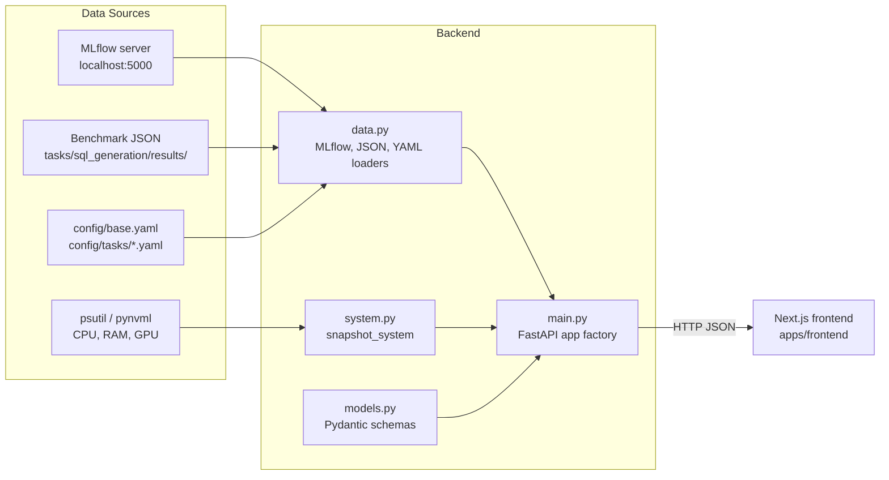

# model-tailor Dashboard Backend

FastAPI service that exposes local training, evaluation, and system data to the
Next.js dashboard frontend in `apps/frontend`. It reads from three sources:

- MLflow (tracking URI and experiment from `config/base.yaml`)
- Benchmark JSON reports in `tasks/sql_generation/results/`
- Live host metrics via `psutil` and `pynvml` (with a `torch.cuda` fallback)

## Architecture



## Setup

Install dependencies into the project virtual environment:

```bash
pip install -r apps/backend-py/requirements.txt
```

## Running the Development Server

The launcher probes for the first free TCP port starting at 8000, publishes the
chosen port to `apps/backend-py/.dev-port` (consumed by the frontend launcher),
and starts uvicorn:

```bash
python apps/backend-py/scripts/dev_server.py
```

Or via the root Makefile:

```bash
make dashboard-backend
```

A fixed port or host can be requested explicitly:

```bash
python apps/backend-py/scripts/dev_server.py --port 8000 --host 127.0.0.1
```

## Endpoints

| Method | Path | Description |
|--------|------|-------------|
| GET | `/health` | Liveness probe. |
| GET | `/config` | MLflow tracking URI and experiment name. |
| GET | `/runs` | MLflow runs for the configured experiment. |
| GET | `/runs/{run_id}/metrics/{metric_key}` | Step/value history for one metric (slashes in the key are supported). |
| GET | `/benchmarks` | Summaries of benchmark JSON reports. |
| GET | `/benchmarks/{filename}` | Full benchmark report for one file. |
| GET | `/system` | Live CPU, RAM, and GPU snapshot. |
| GET | `/configs` | Parsed contents of `config/base.yaml` and `config/tasks/sql_generation.yaml`. |

Interactive OpenAPI documentation is available at `/docs` while the server is
running.

## Configuration

| Environment variable | Default | Purpose |
|----------------------|---------|---------|
| `BENCHMARK_RESULTS_DIR` | `tasks/sql_generation/results/` | Override the directory scanned for benchmark JSON reports. |

The project root is auto-detected by walking up from this package until
`config/base.yaml` is found, so the server works regardless of the current
working directory.

## Tests

```bash
cd apps/backend-py && pytest tests/ -v
```
