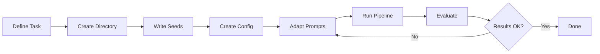

# Adding a New Task

model-tailor is designed to work with any text-in/text-out task. The SQL generation task is the included example, but the same pipeline works for email writing, data extraction, summarization, code generation, and more.

This guide walks through adding a new task from scratch.



## Step 1: Define the Task

Before writing any config, answer these questions:

1. **What is the input?** (e.g., "a user request for an email" or "unstructured text to extract from")
2. **What is the output?** (e.g., "a professional email" or "structured JSON")
3. **How do you measure success?** (e.g., human rating, format compliance, similarity to reference)
4. **What does a good seed example look like?**

## Step 2: Create Task Directory

```bash
mkdir -p tasks/email_writing
```

## Step 3: Write Seed Examples

Create `tasks/email_writing/seeds.jsonl` with 10-20 hand-crafted examples.

The standard record format uses `nl` (natural language input) and `sql` (output), but you can use any field names as long as you're consistent. For non-SQL tasks, think of `nl` as the input and `sql` as the target output — or rename them in your task config.

```jsonl
{"nl": "Write a follow-up email after a job interview at Google for a senior engineer position", "output": "Subject: Thank you for the interview...", "difficulty": "easy", "category": "follow_up"}
{"nl": "Decline a meeting invitation politely, suggesting an alternative time next week", "output": "Hi [Name],\n\nThank you for the invitation...", "difficulty": "medium", "category": "decline"}
```

**Tips for good seeds:**
- Cover the full range of difficulty levels
- Include diverse categories/types
- Make the inputs sound like real users (casual, varied phrasing)
- Make the outputs high quality — the teacher model will mimic this quality level

## Step 4: Create Task Config

Create `config/tasks/email_writing.yaml`:

```yaml
task:
  name: email_writing
  description: "Generate professional emails from intent descriptions"

generation:
  teacher_model: gpt-4o-mini
  num_examples: 3000
  batch_size: 5               # Emails are longer, smaller batches
  seed_file: tasks/email_writing/seeds.jsonl

  difficulty_distribution:
    easy: 0.3                  # Simple replies, short confirmations
    medium: 0.5                # Standard business emails
    hard: 0.2                  # Complex negotiations, sensitive topics

  categories:
    - follow_up
    - decline
    - request
    - apology
    - introduction
    - confirmation
    - complaint

curation:
  min_query_length: 10
  max_query_length: 2000      # Emails can be longer than SQL
  dedup_threshold: 0.80       # Slightly more aggressive dedup for text

evaluation:
  llm_judge: true
  judge_model: gpt-4o-mini
```

## Step 5: Adapt Generation Prompts (Optional)

The generation strategies in `src/generate/strategies.py` use SQL-specific prompts by default. For a new task, you have two options:

### Option A: Use the Existing Strategies

The strategies work with any task if your seeds follow the `natural_language` / `sql` field naming. The prompts reference "NL->SQL pairs" but the teacher model will adapt to whatever your seeds look like. This works surprisingly well for most tasks.

### Option B: Create Task-Specific Prompts

For best quality, create custom system prompts. You can override the prompt in `strategies.py` or create a new strategy class:

```python
from src.generate.strategies import GenerationStrategy, GeneratedExample, Message

class EmailStrategy(GenerationStrategy):
    name = "email_generation"

    def generate(self, num_examples, schema=None, seeds=None, difficulty="medium"):
        messages = [
            Message(role="system", content="You are an expert email writer..."),
            Message(role="user", content=f"Generate {num_examples} email examples...")
        ]
        # ... same pattern as existing strategies
```

## Step 6: Adapt Evaluation

For SQL, we have execution accuracy. For other tasks, you'll rely more on:

- **LLM-as-Judge** — Works for any task. Customize the rubric in `src/evaluate/judge.py`
- **Format compliance** — For structured output tasks (JSON extraction), check that output parses correctly
- **ROUGE/BLEU** — Reasonable for text generation tasks like email writing

You may want to customize the judge prompt for your task:

```python
from src.evaluate.judge import LLMJudge

judge = LLMJudge()
# The default rubric checks correctness, efficiency, readability, edge cases
# For emails, you might want: tone, completeness, professionalism, grammar
```

## Step 7: Run the Pipeline

The pipeline is the same regardless of task:

```bash
# 1. Generate
python -c "
from src.generate.batch import run_generation
run_generation(config_path='config/tasks/email_writing.yaml')
"

# 2-6. Follow notebooks 02_curate through 06_deploy
# Or adapt the task-specific config paths
```

## Step 8: Format Considerations

For non-SQL tasks, the system prompt in `src/format/templates.py` needs to match your task. Either:

1. Pass a custom `system_prompt` to `ChatTemplate.build_conversation()`
2. Or create task-specific system prompts in your task config

```python
from src.format.templates import ChatTemplate

template = ChatTemplate()
conversations = [
    template.build_conversation(
        example,
        system_prompt="You are a professional email writing assistant. Write clear, concise, and appropriately toned business emails based on the user's request."
    )
    for example in train_data
]
```

## Checklist

When adding a new task, make sure you have:

- [ ] `tasks/<task_name>/seeds.jsonl` — 10-20 seed examples
- [ ] `config/tasks/<task_name>.yaml` — Task configuration
- [ ] Appropriate difficulty distribution for your task
- [ ] Categories that cover the full range of outputs
- [ ] A clear evaluation strategy (what metric is your "execution accuracy"?)
- [ ] Custom system prompt for instruction tuning format
- [ ] Test the full pipeline on a small run (100 examples) before scaling up
