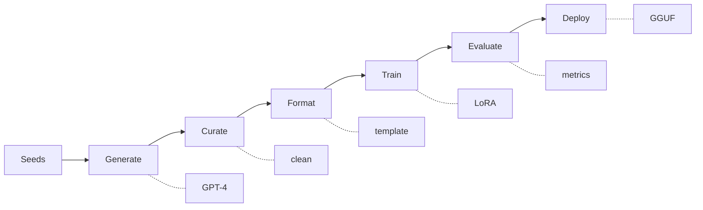

# Architecture

## Overview

model-tailor is a pipeline that turns a large teacher model (GPT-4) into training data for a small student model (8B parameters). The pipeline has six stages, each handled by a dedicated module under `src/`.



## Data Flow

```mermaid
flowchart TD
    subgraph Inputs
        seeds["tasks/sql_generation/seeds.jsonl\n(Hand-crafted seed examples)"]
        schemas["tasks/sql_generation/schemas.sql\n(Database schemas)"]
    end

    subgraph generate["src/generate/"]
        direction LR
        g_desc["Teacher LLM generates synthetic NL-SQL pairs"]
        g_files["strategies.py — seed_expansion, self_instruct, evol_instruct\nquality.py — heuristic / syntax / LLM scoring\nbatch.py — async batching with concurrency control"]
    end

    subgraph curate["src/curate/"]
        direction LR
        c_desc["Clean and prepare dataset"]
        c_files["dedup.py — exact + fuzzy MinHash deduplication\nfilter.py — length, SQL validity, keyword, score filters\nbalance.py — resample to target difficulty distribution\nsplit.py — stratified train/val/test splits 80/10/10"]
    end

    subgraph format["src/format/"]
        direction LR
        f_desc["Convert to instruction-tuning format"]
        f_files["templates.py — build system/user/assistant conversations\nfamilies.py — apply model-specific templates Llama, Mistral, Phi\ntokenize.py — validate token lengths, handle oversized examples"]
    end

    subgraph train["src/train/"]
        direction LR
        t_desc["Fine-tune with QLoRA"]
        t_files["lora.py — load 4-bit base model, attach LoRA adapters\nrunner.py — SFTTrainer wrapper with HuggingFace TRL\nmonitor.py — WandB callbacks, overfitting detection"]
    end

    subgraph evaluate["src/evaluate/"]
        direction LR
        e_desc["Measure quality"]
        e_files["metrics.py — BLEU, ROUGE, exact match, execution accuracy\njudge.py — LLM-as-judge with structured rubric\nbenchmark.py — full benchmark runner with comparison"]
    end

    subgraph deploy["src/deploy/"]
        direction LR
        d_desc["Ship it"]
        d_files["export.py — merge LoRA + export to GGUF or HuggingFace\nquantize.py — Q4_K_M, Q5_K_M, Q8_0, F16\nserve.py — FastAPI server with /generate_sql endpoint"]
    end

    seeds --> generate
    schemas --> generate
    generate -- "data/raw/*.jsonl" --> curate
    curate -- "data/curated/{train,val,test}.jsonl" --> format
    format -- "data/formatted/{train,val}.jsonl" --> train
    train -- "models/name-lora/ (adapter weights)" --> evaluate
    evaluate -- "benchmark results (dict/JSON)" --> deploy
    deploy --> output["models/name.gguf\nRunning API server"]
```



## Shared Components

### src/llm/client.py — TeacherClient
The teacher model client is used by three modules:
- `generate/` — generates synthetic training data
- `curate/` (via `generate/quality.py`) — LLM-based quality scoring
- `evaluate/judge.py` — LLM-as-judge evaluation

It supports three providers:
- **OpenAI** — GPT-4o, GPT-4o-mini (via `openai` SDK)
- **Anthropic** — Claude Sonnet, Haiku (via `anthropic` SDK)
- **Ollama** — Any local model (via OpenAI-compatible API)

### config/
- `base.yaml` — Global defaults (teacher model, training hyperparameters, paths)
- `tasks/<name>.yaml` — Per-task configuration (generation, curation, evaluation settings)

Configuration is loaded by each module as needed. There's no central config object — each module reads the YAML keys it cares about.

## Design Principles

1. **Each module is independently usable.** You can use `src/curate/` without `src/generate/` if you have data from another source. Modules communicate through JSONL files, not internal APIs.

2. **No implicit state.** Every function takes explicit inputs and returns explicit outputs. No global singletons, no hidden side effects.

3. **Flat structure.** Module names are verbs (`generate`, `curate`, `format`, `train`, `evaluate`, `deploy`), not nouns. No nested `modules/` or `components/` directories.

4. **JSONL as interchange format.** Data flows between stages as JSONL files. Each line is a self-contained JSON object with `nl`, `sql`, `difficulty`, `category`, and optional metadata fields.

5. **Config over code.** Task-specific settings (difficulty distribution, teacher model, evaluation metrics) live in YAML config files, not hardcoded in Python.

## Record Schema

The standard record format flowing through the pipeline:

```json
{
  "nl": "Find all employees with salary above 75000",
  "sql": "SELECT * FROM employees WHERE salary > 75000;",
  "difficulty": "easy",
  "category": "select",
  "schema": "hr",
  "score": 4.5,
  "strategy": "seed_expansion"
}
```

Required fields: `nl`, `sql`
Optional fields: `difficulty`, `category`, `schema`, `score`, `strategy`, `metadata`

The `generate/` module outputs `natural_language` and `sql` keys (via `GeneratedExample` dataclass). Downstream modules normalize these to `nl` and `sql`.
