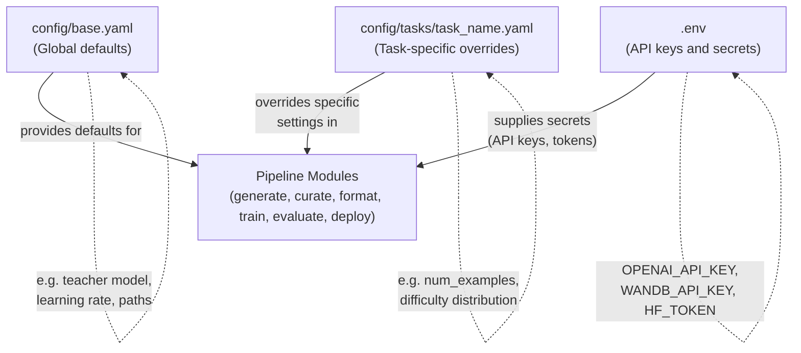

# Configuration Reference



All configuration lives in YAML files under `config/`.

## config/base.yaml

Global defaults used across the pipeline.

```yaml
project:
  name: model-tailor    # Project name (used in WandB, logging)
  seed: 42              # Random seed for reproducibility

paths:
  data_raw: data/raw           # Raw generated data
  data_curated: data/curated   # After curation pipeline
  data_formatted: data/formatted  # Ready for training
  data_seeds: data/seeds       # Seed examples
  models: models               # Trained model outputs
  checkpoints: checkpoints     # Training checkpoints

teacher:
  provider: openai             # openai | anthropic | gemini | glm | ollama
  model: gpt-4o-mini           # Model name for the provider
  temperature: 0.7             # Generation temperature
  max_tokens: 2048             # Max tokens per response
  ollama_base_url: http://localhost:11434  # Ollama server URL (only used when provider: ollama)

defaults:
  model_family: llama          # llama | mistral | phi
  base_model: unsloth/Meta-Llama-3.1-8B-Instruct-bnb-4bit
  split_ratios: [0.8, 0.1, 0.1]  # Train/val/test split
  batch_size: 4                # Training batch size
  num_epochs: 3                # Training epochs
  learning_rate: 2.0e-4        # Learning rate
  lora_rank: 16                # LoRA rank
  lora_alpha: 16               # LoRA alpha

wandb:
  project: model-tailor        # WandB project name
  log_model: false             # Whether to log model artifacts to WandB
```

### Teacher Provider Options

**OpenAI** (default):
```yaml
teacher:
  provider: openai
  model: gpt-4o-mini    # or gpt-4o, gpt-4-turbo
```
Requires `OPENAI_API_KEY` in `.env`.

**Anthropic**:
```yaml
teacher:
  provider: anthropic
  model: claude-sonnet-4-20250514  # or claude-haiku-4-5-20251001
```
Requires `ANTHROPIC_API_KEY` in `.env`.

**Gemini**:

```yaml
teacher:
  provider: gemini
  model: gemini-2.0-flash      # or gemini-2.5-pro, gemini-2.5-flash
```

Requires `GEMINI_API_KEY` in `.env`. Get one at [Google AI Studio](https://aistudio.google.com).

**GLM** (Zhipu AI):

```yaml
teacher:
  provider: glm
  model: glm-4.6               # or glm-4.7, glm-4-plus
```

Requires `GLM_API_KEY` in `.env`. Get one at [Zhipu AI Open Platform](https://open.bigmodel.cn/). Uses OpenAI-compatible API with base URL `https://open.bigmodel.cn/api/paas/v4/`.

**Ollama** (local, free):

```yaml
teacher:
  provider: ollama
  model: llama3.1              # any model pulled with `ollama pull`
  ollama_base_url: http://localhost:11434
```

No API key needed. Requires Ollama running locally. See [Ollama Setup](ollama-setup.md) for installation and configuration instructions.

### Model Family Options

| Family | Base Model | Template Style |
|--------|-----------|---------------|
| `llama` | `unsloth/Meta-Llama-3.1-8B-Instruct-bnb-4bit` | `<\|start_header_id\|>system<\|end_header_id\|>` |
| `mistral` | `unsloth/Mistral-7B-Instruct-v0.3-bnb-4bit` | `[INST] ... [/INST]` |
| `phi` | `unsloth/Phi-3.5-mini-instruct-bnb-4bit` | `<\|user\|> ... <\|end\|>` |

---

## config/tasks/sql_generation.yaml

Task-specific configuration for the SQL generation proof-of-work.

```yaml
task:
  name: sql_generation
  description: "Natural language to SQL query generation"

generation:
  teacher_model: gpt-4o        # Override teacher model for this task
  num_examples: 5000           # Total examples to generate
  batch_size: 10               # Examples per API call
  seed_file: tasks/sql_generation/seeds.jsonl
  schema_file: tasks/sql_generation/schemas.sql

  difficulty_distribution:     # Target distribution across difficulties
    easy: 0.3                  # Single table, basic WHERE
    medium: 0.4                # JOINs, GROUP BY, HAVING
    hard: 0.2                  # Subqueries, window functions, CTEs
    expert: 0.1                # Complex multi-step reasoning

  categories:                  # SQL query types to generate
    - select
    - aggregate
    - join
    - subquery
    - window_function
    - insert
    - update
    - delete

curation:
  min_query_length: 10         # Min characters for NL/SQL
  max_query_length: 500        # Max characters for SQL
  require_valid_sql: true      # Filter out invalid SQL
  dedup_threshold: 0.85        # Jaccard similarity for fuzzy dedup

evaluation:
  execution_accuracy: true     # Run SQL against DB and compare results
  exact_match: true            # Normalized string match
  llm_judge: true              # Use LLM to score quality
  judge_model: gpt-4o-mini     # Model for judging
  test_db: tasks/sql_generation/schemas.sql  # SQLite DB for execution testing
```

---

## .env

Environment variables for API keys and service URLs. Copy from `.env.example`:

```bash
cp .env.example .env
```

| Variable | Required For | Description |
|----------|-------------|-------------|
| `OPENAI_API_KEY` | OpenAI provider | API key from platform.openai.com |
| `ANTHROPIC_API_KEY` | Anthropic provider | API key from console.anthropic.com |
| `GEMINI_API_KEY` | Gemini provider | API key from aistudio.google.com |
| `GLM_API_KEY` | GLM provider | API key from open.bigmodel.cn |
| `WANDB_API_KEY` | Training monitoring | API key from wandb.ai |
| `HF_TOKEN` | HuggingFace Hub push | Token from huggingface.co/settings/tokens |
| `OLLAMA_BASE_URL` | Ollama provider | Defaults to `http://localhost:11434` |

---

## Adding a New Task

To create configuration for a new task (e.g., email writing):

1. Create `config/tasks/email_writing.yaml` following the structure of `sql_generation.yaml`
2. Create `tasks/email_writing/seeds.jsonl` with seed examples
3. Update the `generation`, `curation`, and `evaluation` sections for your task
4. See `docs/adding-tasks.md` for the full guide
