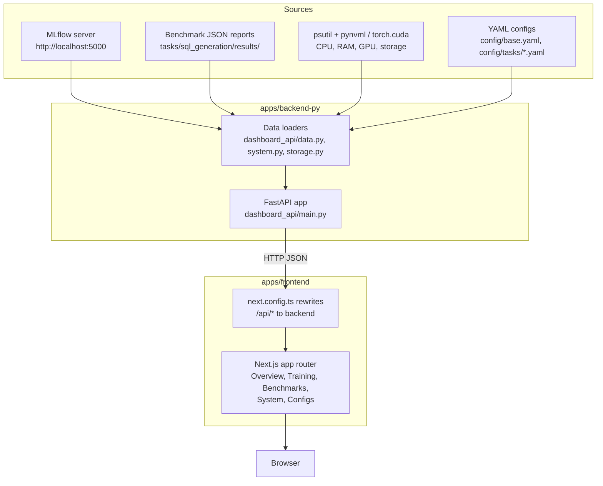
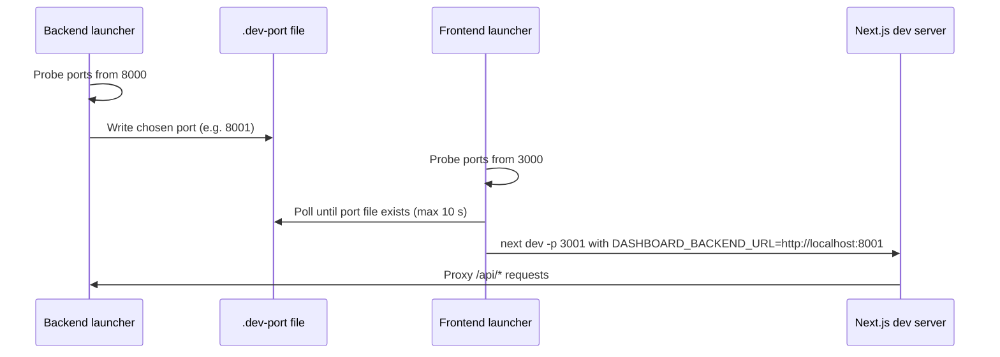

# Dashboard Guide

The model-tailor dashboard is a local-only web interface for monitoring
configuration, training runs, benchmark results, and host resource usage. It
exists because cloud consoles (GCP, Anthropic) are not always available; every
data source it reads lives on the local machine.

## Architecture

The dashboard is split into two applications under `apps/`:

- `apps/backend-py` — a FastAPI service that reads MLflow runs, benchmark JSON
  reports, YAML configs, and live system metrics.
- `apps/frontend` — a Next.js (TypeScript, Tailwind CSS, Recharts) frontend
  that proxies API requests to the backend.



## Quick Start

Start both servers with port delegation handled automatically:

```bash
make dashboard
```

Or start each side independently:

```bash
make dashboard-backend
```

```bash
make dashboard-frontend
```

Then open the printed frontend URL (default `http://localhost:3000`).

## Port Delegation

Both dev servers delegate instead of failing when their default port is taken:

1. The backend launcher (`apps/backend-py/scripts/dev_server.py`) probes TCP
   ports from 8000 upward, binds the first free one, and writes it to
   `apps/backend-py/.dev-port`.
2. The frontend launcher (`apps/frontend/scripts/dev-with-port.mjs`) probes
   from 3000 upward, then waits up to 10 seconds for `.dev-port` to appear so
   it can point the Next.js rewrite proxy at the correct backend port.
3. If `.dev-port` never appears, the frontend falls back to
   `http://localhost:8000`; set `DASHBOARD_BACKEND_URL` to override resolution
   entirely.



## Pages

| Page | Route | Data source |
|------|-------|-------------|
| Overview | `/` | Run/benchmark counts plus live system cards. |
| Training | `/training` | MLflow run selector, parameter table, per-metric charts. |
| Benchmarks | `/benchmarks` | Benchmark report selector with metric charts and tables. |
| System | `/system` | CPU/RAM/GPU/storage snapshot, refreshed every 2 seconds. |

External drives are shown with an amber **External** badge rather than being
hidden, so it is always clear whether a drive is built-in or removable.

The System page refreshes every 2 seconds, but the backend protects itself:

- The full storage snapshot is cached for 5 seconds so frequent polls do not
  re-scan every partition.
- Individual drive-usage reads time out after 1 second; a stale or unresponsive
  mount is skipped instead of hanging the snapshot.
- The overall `/system` snapshot runs in a worker thread with a 5-second
  timeout and a single-flight lock, so it cannot block the rest of the API.

### Storage Classification

The storage scanner reports every real partition it can read and classifies each
one as built-in or external using platform-aware heuristics:

- **WSL** — Windows `drvfs` drives (`/mnt/c`, `/mnt/d`, etc.) are mapped to their
  physical disk bus type via PowerShell (`Get-Partition` joined to
  `Get-PhysicalDisk`). SATA, NVMe, SAS, ATA, IDE, and SCSI are treated as
  built-in; USB and UASP are treated as external. WSL internal rootfs mounts are
  always treated as built-in.
- **Native Linux** — the scanner reads `/sys/class/block/<device>/removable` and,
  when `lsblk` is available, checks the `TRAN` (transport) column. Removable or
  USB transports are shown as external.
- **Native Windows** — the same PowerShell bus-type lookup is used.
- **macOS / other** — drives default to external so removable media are never
  silently labelled as built-in.

PowerShell bus-type lookups are cached for 30 seconds to avoid spawning a shell
on every 2-second frontend poll.
| Configs | `/configs` | Side-by-side view of `config/base.yaml` and the SQL task config. |

## Benchmark Reports

`scripts/run_gate_benchmark.py` always writes a JSON report. When `--output` is
omitted, the report lands in `tasks/sql_generation/results/` with the filename
pattern `<model-slug>_<YYYYMMDD_HHMMSS>.json`:

```bash
python scripts/run_gate_benchmark.py --test-file data/curated/test.jsonl --db-path tasks/sql_generation/db.sqlite
```

Report structure:

```json
{
  "model": "claude-sonnet-4-6",
  "num_examples": 14,
  "elapsed_seconds": 59.4,
  "throughput_examples_per_sec": 0.236,
  "overall_metrics": {"gate/pass_rate": 0.93},
  "gate_metrics": {"gate/passed": 13.0, "gate/failed": 1.0},
  "repair_metrics": {"repair/attempted": 1.0, "repair/succeeded": 1.0}
}
```

The backend scans that directory (override with `BENCHMARK_RESULTS_DIR`) and
the Benchmarks page renders the numeric metrics.

## Backend Endpoints

| Method | Path | Description |
|--------|------|-------------|
| GET | `/health` | Liveness probe. |
| GET | `/config` | MLflow tracking URI and experiment name. |
| GET | `/runs` | MLflow runs for the configured experiment. |
| GET | `/runs/{run_id}/metrics/{metric_key}` | Metric history; keys containing slashes are supported via a path converter. |
| GET | `/benchmarks` | Benchmark report summaries. |
| GET | `/benchmarks/{filename}` | One full benchmark report (filename validated against traversal). |
| GET | `/system` | Live CPU, RAM, GPU, and storage snapshot (5-second storage cache, 5-second server timeout). |
| GET | `/configs` | Parsed base and task YAML configs. |

## Verification

Backend lint and tests:

```bash
cd apps/backend-py && ruff check src scripts tests && pytest tests/ -v
```

Frontend production build:

```bash
cd apps/frontend && npm run build
```

Full repository check (root pipeline plus dashboard backend):

```bash
make check
```

## Troubleshooting

| Symptom | Cause | Resolution |
|---------|-------|------------|
| Frontend shows empty runs | MLflow server not running | Start it with `mlflow ui --port 5000`; the dashboard still renders other pages. |
| Frontend proxies to the wrong port | Backend started after the 10 s wait window | Restart the frontend, or set `DASHBOARD_BACKEND_URL` explicitly. |
| GPU section shows unavailable | `pynvml` missing and no `torch.cuda` | Install `pynvml`; CPU/RAM monitoring is unaffected. |
| Benchmarks page is empty | No reports written yet | Run `scripts/run_gate_benchmark.py` once. |
