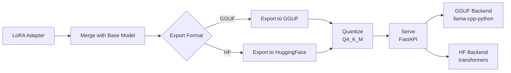

# Deployment Guide

## Overview

The deployment pipeline takes a trained LoRA adapter and turns it into a production-ready inference endpoint:

```
LoRA adapter → Merge with base model → Export to GGUF → Quantize → Serve via FastAPI
```



## Step 1: Merge and Export

**Source**: `src/deploy/export.py`

After training, you have LoRA adapter weights (small, ~50-100 MB). To deploy, you merge them with the base model to get a standalone model.

### Export to GGUF (Recommended for Serving)

```python
from unsloth import FastLanguageModel
from src.deploy.export import merge_and_export

model, tokenizer = FastLanguageModel.from_pretrained('models/sql-llama-8b-lora')

merge_and_export(
    model=model,
    tokenizer=tokenizer,
    output_dir='models/sql-llama-8b-gguf',
    format='gguf'         # Export to GGUF format
)
```

GGUF (GPT-Generated Unified Format) is the standard format for llama.cpp. It's optimized for inference with low memory overhead.

### Export to HuggingFace Format

```python
merge_and_export(
    model=model,
    tokenizer=tokenizer,
    output_dir='models/sql-llama-8b-hf',
    format='hf'           # Export as safetensors
)
```

Use this when you want to continue fine-tuning, use HuggingFace pipelines, or push to HuggingFace Hub.

### Push to HuggingFace Hub

```python
from src.deploy.export import push_to_hub

push_to_hub(
    output_dir='models/sql-llama-8b-hf',
    repo_id='your-username/sql-llama-8b',
    private=True
)
```

Requires `HF_TOKEN` in `.env`.

## Step 2: Quantize

**Source**: `src/deploy/quantize.py`

Quantization reduces model size for faster inference and lower memory usage.

### Quantization Options

| Type | Bits/Weight | Size (8B) | Quality Loss | Best For |
|------|------------|-----------|-------------|----------|
| F16 | 16 | ~16 GB | None | Development, benchmarking |
| Q8_0 | 8 | ~8 GB | Negligible | Production with GPU |
| Q5_K_M | 4.83 | ~5.5 GB | Minimal | Balanced production |
| Q4_K_M | 4.83 | ~4.5 GB | Small (1-3%) | Resource-constrained deployment |

### Quantize a GGUF Model

```python
from src.deploy.quantize import quantize_gguf, estimate_model_size

# Check sizes first
for bits in [4, 5, 8, 16]:
    size = estimate_model_size(8e9, bits)
    print(f"{bits}-bit: ~{size['size_gb']:.1f} GB")

# Quantize
quantize_gguf(
    input_path='models/sql-llama-8b-gguf/model-f16.gguf',
    output_path='models/sql-llama-8b-gguf/model-q4_k_m.gguf',
    quant_type='q4_k_m'
)
```

Note: Requires `llama-quantize` binary from llama.cpp to be in your PATH.

### Compare Quantization Quality

```python
from src.deploy.quantize import compare_quantizations

results = compare_quantizations(
    model_path='models/sql-llama-8b-gguf/',
    test_prompts=[
        "Write SQL to find all employees with salary above 75000",
        "Write SQL to count orders by month",
    ],
    quant_types=["q4_k_m", "q8_0", "f16"]
)

for r in results:
    print(f"{r['quant_type']}: {r['size_mb']:.0f} MB, {r['tokens_per_second']:.1f} tok/s")
```

## Step 3: Serve

**Source**: `src/deploy/serve.py`

FastAPI server with two model backends (GGUF via llama-cpp-python, HuggingFace via transformers).

### Start the Server

```bash
# Set model path
export MODEL_PATH=models/sql-llama-8b-gguf/model-q4_k_m.gguf

# Start server
uvicorn src.deploy.serve:app --host 0.0.0.0 --port 8000
```

Or programmatically:

```python
from src.deploy.serve import create_app
import uvicorn

app = create_app('models/sql-llama-8b-gguf/model-q4_k_m.gguf', model_type='gguf')
uvicorn.run(app, host='0.0.0.0', port=8000)
```

### API Endpoints

**POST /generate** — Free-form text generation

```bash
curl -X POST http://localhost:8000/generate \
  -H "Content-Type: application/json" \
  -d '{"prompt": "Write SQL to find all employees older than 30", "max_tokens": 256}'
```

Response:
```json
{
  "response": "SELECT * FROM employees WHERE age > 30;",
  "tokens_generated": 12,
  "elapsed_seconds": 0.45
}
```

**POST /generate_sql** — SQL-specific endpoint with schema context

```bash
curl -X POST http://localhost:8000/generate_sql \
  -H "Content-Type: application/json" \
  -d '{
    "question": "Find employees who earn more than their manager",
    "schema": "CREATE TABLE employees (id INT, name TEXT, salary INT, manager_id INT);"
  }'
```

Response:
```json
{
  "sql": "SELECT e.name FROM employees e JOIN employees m ON e.manager_id = m.id WHERE e.salary > m.salary;",
  "tokens_generated": 28,
  "elapsed_seconds": 0.82
}
```

**GET /health** — Health check

```bash
curl http://localhost:8000/health
```

Response:
```json
{
  "status": "healthy",
  "model_path": "models/sql-llama-8b-gguf/model-q4_k_m.gguf",
  "model_type": "gguf"
}
```

### Docker Deployment

```bash
# Build and run with GPU support
docker-compose up --build

# Or build manually
docker build -t model-tailor .
docker run --gpus all -p 8000:8000 -v ./models:/app/models model-tailor
```

The `docker-compose.yaml` mounts `models/` and `data/` volumes and reserves one GPU.

## Hosting Options

### Self-Hosted (Cheapest)

| Option | Cost | Pros | Cons |
|--------|------|------|------|
| Local machine (RTX 4090) | One-time $1,600 | Zero ongoing cost, full control | Requires hardware, power, maintenance |
| VPS with GPU (RunPod, Lambda) | $0.50-3.50/hr | Scalable, no hardware management | Ongoing cost, cold starts |
| Docker on any cloud VM | $50-200/month | Flexible, portable | Need to manage infrastructure |

### Managed Hosting

| Option | Cost | Pros | Cons |
|--------|------|------|------|
| HuggingFace Inference Endpoints | ~$1-5/hr | Easy setup, HF integration | Locked to HF ecosystem |
| Replicate | Per-prediction pricing | Zero infrastructure | Higher per-token cost |
| Ollama (local) | Free | Simple setup, good for development | Not production-grade |

### Recommendation

For most use cases: **Q4_K_M GGUF + FastAPI on a $50/month VPS** gives the best cost/performance ratio. For development and testing, use Ollama locally.
