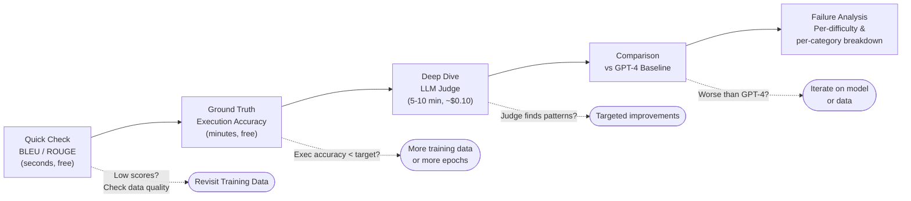

# Evaluation Guide

## Overview

The `src/evaluate/` module provides three evaluation approaches, each useful for different purposes:

| Method | Cost | Speed | Reliability | Best For |
|--------|------|-------|-------------|----------|
| Traditional Metrics | Free | Fast | Medium | Quick sanity checks, CI/CD |
| SQL Execution Accuracy | Free | Medium | High | Ground truth for SQL tasks |
| LLM-as-Judge | API tokens | Slow | High | Qualitative analysis, detailed feedback |

## Traditional Metrics

**Source**: `src/evaluate/metrics.py`

### Exact Match

Normalizes both predicted and target SQL (lowercase, strip whitespace, remove semicolons, format with sqlparse), then checks string equality.

```python
from src.evaluate.metrics import exact_match
score = exact_match(
    "SELECT * FROM users WHERE age > 30",
    "select * from users where age>30"
)
# Returns 1.0 (match after normalization)
```

Good for detecting perfect predictions. Harsh metric — semantically equivalent queries with different formatting score 0.

### BLEU Score

Sentence-level BLEU with smoothing. Measures n-gram overlap between prediction and target.

```python
from src.evaluate.metrics import bleu_score
score = bleu_score(pred_sql, target_sql)
# Returns 0.0 - 1.0
```

Useful as a rough similarity measure. Correlates poorly with actual SQL correctness (a query can have high BLEU but return wrong results).

### ROUGE Scores

ROUGE-1, ROUGE-2, and ROUGE-L (F-measure). Measures recall-oriented text overlap.

```python
from src.evaluate.metrics import rouge_scores
scores = rouge_scores(pred_sql, target_sql)
# Returns {"rouge1": 0.85, "rouge2": 0.72, "rougeL": 0.80}
```

### SQL Execution Accuracy

The gold standard for SQL evaluation. Executes both the predicted and target SQL against a real SQLite database and compares result sets (unordered).

**Prerequisite** -- Create the test database from the schema file:

```bash
sqlite3 tasks/sql_generation/test.db < tasks/sql_generation/schemas.sql
```

```python
from src.evaluate.metrics import sql_execution_accuracy
score = sql_execution_accuracy(
    pred_sql="SELECT name FROM users WHERE age > 30 ORDER BY name",
    target_sql="SELECT name FROM users WHERE age > 30 ORDER BY name ASC",
    db_path="tasks/sql_generation/test.db"
)
# Returns 1.0 if both queries return the same rows
```

This catches cases where the SQL is written differently but produces identical results. It also catches cases where the SQL looks similar but produces different results.

## Execution Correctness Gate

**Source**: `src/evaluate/gate.py`

For batch evaluation and generation filtering, the execution gate provides a reusable pass/fail oracle with failure classification. It materialises a fresh SQLite database from a DDL schema, executes the predicted query with a timeout, and compares result sets when a reference query is available.

```python
from src.evaluate.gate import ExecutionGate

gate = ExecutionGate(
    schema_sql_path="tasks/sql_generation/schemas.sql",
    timeout=5.0,
    allow_empty_result=False,
)

records = [
    {"natural_language": "Get all users", "sql": "SELECT * FROM users;", "target_sql": "SELECT * FROM users;"},
]
results = gate.check_batch(records)
for record, result in zip(records, results):
    print(f"{result.summary()}: {record['sql']}")
```

Failure classifications:

- `passed` — query executed and result set matches the target (or execution alone is sufficient when no target is supplied)
- `syntax_error` — query is empty or could not be parsed
- `execution_error` — query failed at runtime (missing table, missing column, etc.)
- `wrong_result` — query executed but returned a different result set than the target
- `timeout` — query did not finish within the configured timeout
- `empty_result` — query returned zero rows and `allow_empty_result=False`
- `unsafe` — query contains forbidden keywords such as `DROP`, `ALTER`, or `PRAGMA`

### Batch Evaluation

Run all selected metrics across a dataset:

```python
from src.evaluate.metrics import evaluate_batch

results = evaluate_batch(
    predictions=["SELECT ...", "SELECT ...", ...],
    targets=["SELECT ...", "SELECT ...", ...],
    db_path="tasks/sql_generation/test.db",
    metrics=["exact_match", "bleu", "rouge", "exec_accuracy"]
)
# Returns {"exact_match": 0.65, "bleu": 0.78, "rouge1": 0.82, ..., "exec_accuracy": 0.71}
```

## LLM-as-Judge

**Source**: `src/evaluate/judge.py`

Uses a teacher model to evaluate predicted SQL on a structured rubric.

### Scoring Rubric

The judge evaluates on four criteria:

1. **Correctness** — Does the SQL answer the question accurately?
2. **Efficiency** — Is the query reasonably efficient (no unnecessary subqueries, proper use of indexes)?
3. **Readability** — Is the SQL well-formatted and easy to understand?
4. **Edge Cases** — Does the query handle NULLs, empty results, edge conditions?

Overall score: 1-5 scale
- **5**: Perfect or equivalent to reference (cosmetic differences only)
- **4**: Minor issues that don't affect results
- **3**: Partially correct, returns some right results
- **2**: Significant errors, wrong approach
- **1**: Incorrect, fails to execute, or answers wrong question

### Usage

```python
from src.evaluate.judge import LLMJudge

judge = LLMJudge()  # Uses TeacherClient from config

# Single example
result = judge.judge_single(
    nl_query="Find employees earning more than their manager",
    pred_sql="SELECT e.name FROM employees e JOIN employees m ON e.manager_id = m.id WHERE e.salary > m.salary",
    target_sql="SELECT e.employee_name FROM employees e INNER JOIN employees m ON e.manager_id = m.employee_id WHERE e.salary > m.salary"
)
print(f"Score: {result.score}/5 — {result.overall}")

# Batch (with concurrency)
examples = [
    {"nl": "...", "pred_sql": "...", "target_sql": "..."},
    ...
]
results = judge.judge_batch(examples, concurrency=4)
avg = judge.mean_score(results)
```

### Tips for LLM-as-Judge

- **Temperature 0.1** — Low temperature for consistent scoring across runs
- **GPT-4o-mini** is cost-effective for judging. GPT-4o gives slightly better judgment but at 10x the cost
- **Sample size** — Judge at least 50 examples for stable average scores. Full test set if budget allows
- **Score 0 = error** — The judge returns score 0 for examples it couldn't evaluate (API error, parse failure). These are excluded from average calculations

## Benchmark Runner

**Source**: `src/evaluate/benchmark.py`

Runs end-to-end evaluation: generates predictions from the model, computes all metrics, and produces a structured report.

```python
from src.evaluate.benchmark import BenchmarkRunner

runner = BenchmarkRunner(
    batch_size=8,
    metrics=["exact_match", "bleu", "exec_accuracy"],
    db_path="tasks/sql_generation/test.db",
    use_judge=True
)

results = runner.run(
    model=model,
    tokenizer=tokenizer,
    test_data=test_data
)

# Structured report
report = BenchmarkRunner.report(results)
```

### Gate and Repair Metrics

When an `ExecutionGate` is supplied, `BenchmarkRunner` reports pass/fail metrics in addition to traditional scores:

```python
from src.evaluate.benchmark import BenchmarkRunner
from src.evaluate.gate import ExecutionGate
from src.generate.repair import SQLRepairer
from src.llm.client import TeacherClient

gate = ExecutionGate(schema_sql_path="tasks/sql_generation/schemas.sql")
repairer = SQLRepairer(client=TeacherClient(), gate=gate, max_attempts=2)

runner = BenchmarkRunner(
    batch_size=8,
    gate=gate,
    repairer=repairer,
    use_repair=True,
)

results = runner.run(model, tokenizer, test_data)
report = BenchmarkRunner.report(results)
print(report["gate_metrics"])
print(report["repair_metrics"])
```

Key metrics:

- `gate_pass_rate` — proportion of queries that passed the gate on the first try
- `gate_final_pass_rate` — proportion that passed after any repairs
- `repair_success_rate` — proportion of repair attempts that resulted in a passing query
- `writer_only_pass_rate` — same as `gate_pass_rate`; writer performance without the fixer
- `writer_plus_fixer_pass_rate` — proportion that passed after routing failures through the repairer

These metrics are also logged to MLFlow via `src/train/monitor.py::log_gate_metrics` when a run is active.

### Comparing Two Models

```python
results_a = runner.run(model_a, tokenizer_a, test_data)
results_b = runner.run(model_b, tokenizer_b, test_data)

comparison = BenchmarkRunner.compare(results_a, results_b)
# Shows per-metric deltas and which model wins
```

### Report Structure

The benchmark report includes:
- **Overall metrics**: Aggregated scores across the full test set
- **Per-difficulty breakdown**: Scores for easy, medium, hard, expert
- **Per-category breakdown**: Scores for select, aggregate, join, subquery, etc.
- **Throughput**: Examples per second, total inference time
- **Judge summary** (if enabled): Mean score, score distribution, error count

## Evaluation Workflow



Recommended evaluation workflow after training:

1. **Quick check**: Run `evaluate_batch` with exact_match and BLEU on val set — takes seconds
2. **Ground truth**: Run execution accuracy on test set — takes minutes
3. **Deep dive**: Run LLM-as-judge on 100 test examples — takes 5-10 minutes, costs ~$0.10
4. **Comparison**: Run the same test set through GPT-4 and compare with `BenchmarkRunner.compare`
5. **Failure analysis**: Look at per-difficulty and per-category breakdowns to find weak spots
