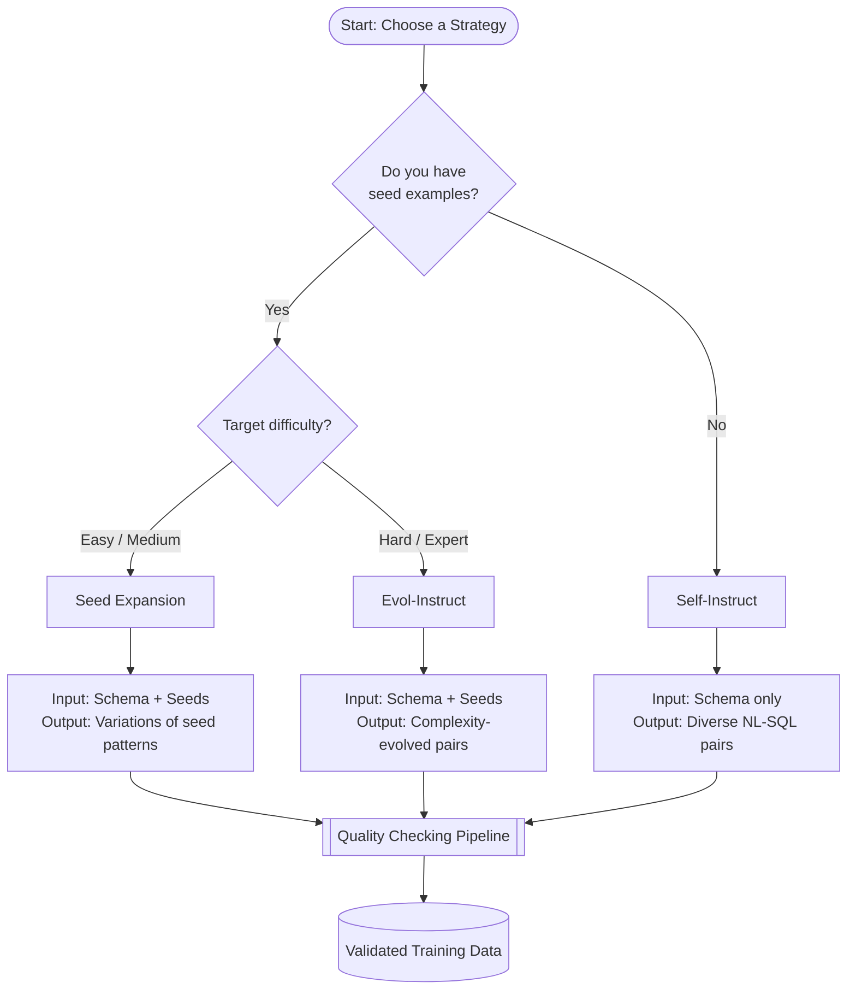

# Generation Strategies

The `src/generate/` module implements three strategies for creating synthetic training data. Each takes a database schema and (optionally) seed examples, then prompts a teacher LLM to produce NL→SQL pairs.

## Strategy Overview

| Strategy | Best For | Requires Seeds | Typical Quality |
|----------|---------|---------------|----------------|
| Seed Expansion | Easy/Medium examples | Yes (1+) | High — stays close to proven patterns |
| Self-Instruct | Broad coverage | No (optional) | Medium — more diverse but higher rejection rate |
| Evol-Instruct | Hard/Expert examples | Yes (1+) | High — systematically increases complexity |



## Seed Expansion

**Source**: `src/generate/strategies.py::SeedExpansion`

Takes existing seed examples and asks the teacher to generate variations. The teacher sees 5 randomly sampled seeds per batch and creates new examples that follow similar patterns but with different tables, columns, conditions, and phrasing.

**How it works**:
1. Sample 5 seeds randomly from the seed pool
2. Build a prompt with the schema + sampled seeds + difficulty target
3. Ask teacher for 10 new examples per batch
4. Parse JSON response, filter empty/invalid entries
5. Repeat until target count is reached

**When to use**: Bootstrapping from a small set of high-quality hand-written examples. Best for easy and medium difficulty levels where you want reliable, consistent quality.

**Prompt structure**:
```
System: You are an expert SQL instructor generating training data...
User: Here is a database schema: [schema]
      Here are seed examples: [5 sampled seeds]
      Generate 10 NEW and DIVERSE NL→SQL pairs.
      Target difficulty: medium (JOINs, GROUP BY, HAVING)
      Return JSON array with keys: natural_language, sql, category
```

**Tips**:
- Quality improves with better seeds — invest time in writing them
- Works well with 5-15 seeds per difficulty level
- Set temperature to 0.7 for diversity, 0.3 for consistency

## Self-Instruct

**Source**: `src/generate/strategies.py::SelfInstruct`

Generates entirely new examples from scratch given only the database schema. Inspired by the [Self-Instruct paper](https://arxiv.org/abs/2212.10560). The teacher invents both the natural-language question and the SQL query.

**How it works**:
1. Optionally include 1-2 seeds as format references (not required)
2. Build a prompt with the schema + difficulty constraints
3. Ask teacher to invent realistic user questions + SQL queries
4. Parse and validate
5. Repeat until target count is reached

**When to use**: Filling coverage gaps. When you want examples that go beyond your seed patterns — different tables, different query types, different phrasing styles.

**Trade-offs**:
- (+) Produces the most diverse examples
- (+) Doesn't require seeds
- (-) Higher rejection rate (10-20% invalid SQL at hard difficulty)
- (-) Quality is less consistent than seed expansion

## Evol-Instruct

**Source**: `src/generate/strategies.py::EvolInstruct`

Takes existing simple examples and systematically increases their complexity. Inspired by [WizardLM's Evol-Instruct](https://arxiv.org/abs/2304.12244).

**How it works**:
1. Pick a seed example from the pool
2. Randomly select 1-2 evolution types:
   - Add a JOIN with another table
   - Add a subquery or CTE
   - Add a window function (ROW_NUMBER, RANK, LAG)
   - Add GROUP BY with HAVING
   - Combine multiple conditions with AND/OR/NOT
   - Add ORDER BY with LIMIT/OFFSET
   - Require a CASE expression
   - Add a UNION or INTERSECT
3. Ask teacher to evolve the seed into 3 harder examples
4. Parse and validate
5. Remove seeds that fail to produce output, repeat

**When to use**: Generating hard and expert examples. Start with easy/medium seeds and evolve them up. This gives more reliable hard examples than asking Self-Instruct for hard queries directly.

**Example evolution**:
```
Original (easy):
  NL: "Find all employees with salary above 75000"
  SQL: SELECT * FROM employees WHERE salary > 75000

Evolved (hard, added JOIN + window function):
  NL: "Show each employee's name, salary, and their rank within their department by salary"
  SQL: SELECT e.employee_name, e.salary, d.department_name,
       RANK() OVER (PARTITION BY e.department_id ORDER BY e.salary DESC) AS dept_rank
       FROM employees e JOIN departments d ON e.department_id = d.department_id
```

## Quality Checking

**Source**: `src/generate/quality.py::QualityChecker`

All strategies pass their output through a three-layer quality check, optionally followed by an execution correctness gate and a repair/fixer loop:

```mermaid
flowchart LR
    Input["Generated\nNL-SQL Pair"] --> L1

    subgraph L1 ["Layer 1: Heuristic Checks"]
        direction TB
        H1["Length bounds OK?"]
        H2["Contains SQL keywords?"]
        H3["No template placeholders?"]
        H4["Balanced parentheses?"]
    end

    L1 -- Fail --> Reject1([Rejected])
    L1 -- Pass --> L2

    subgraph L2 ["Layer 2: SQL Syntax Validation"]
        direction TB
        S1["Parses with sqlparse?"]
        S2["Valid statement type?"]
        S3["No unclosed strings?"]
    end

    L2 -- Fail --> Reject2([Rejected])
    L2 -- Pass --> L3

    subgraph L3 ["Layer 3: LLM Quality Scoring"]
        direction TB
        Q1["Teacher LLM rates 1-5"]
        Q2["Correctness + Naturalness\n+ Complexity + Schema"]
        Q3{"Score >= 3.0?"}
    end

    L3 -- "Score < 3.0" --> Reject3([Rejected])
    L3 -- "Score >= 3.0" --> Gate

    subgraph Gate ["Execution Correctness Gate"]
        direction TB
        G1["Materialise SQLite DB"]
        G2["Execute predicted SQL"]
        G3["Compare result sets\n(if target available)"]
    end

    Gate -- "passed" --> Accept([Accepted])
    Gate -- "failed" --> Repair["Repair / Fixer\n(teacher model)"]
    Repair --> Gate
    Gate -- "still failed" --> Reject4([Rejected])
```



The execution gate and repair loop are controlled from `config/tasks/sql_generation.yaml`:

```yaml
generation:
  execution_gate:
    enabled: true
    timeout: 5.0
    allow_empty_result: false
  repair:
    enabled: true
    max_attempts: 2
    repair_batch_size: 5
```

When enabled, every generated example that survives the three-layer quality check is executed against the task schema. Failures are routed to the repair/fixer, which asks the teacher model to correct the SQL using the gate feedback. Examples that still fail after the maximum number of repair attempts are saved to a separate rejected file for analysis.

### Layer 1: Heuristic Checks (free)
- NL length within bounds (10-500 chars)
- SQL length within bounds (10-1000 chars)
- SQL contains at least one SQL keyword (SELECT, INSERT, etc.)
- NL doesn't look like raw SQL
- No template placeholders (`{{`, `}}`)
- Balanced parentheses

### Layer 2: SQL Syntax Validation (free)
- Parses with `sqlparse`
- Valid statement type (SELECT, INSERT, UPDATE, DELETE, WITH)
- No unclosed string literals
- No trailing commas in SELECT lists

### Layer 3: LLM Quality Scoring (costs tokens)
- Only runs if layers 1 and 2 pass
- Asks teacher to rate 1-5 with structured rubric
- Scores: correctness, naturalness, complexity match, schema adherence
- Default threshold: score >= 3.0

## Batch Generation

**Source**: `src/generate/batch.py::BatchGenerator`

Orchestrates all strategies with:
- Configurable concurrency (async with semaphore)
- Difficulty distribution across strategies
- Progress tracking with tqdm
- JSONL output with all metadata

```python
from src.generate.batch import BatchGenerator
from src.llm.client import TeacherClient

client = TeacherClient()
generator = BatchGenerator(client, config_path='config/tasks/sql_generation.yaml')
results = generator.run_sync(output_path='data/raw/sql_generation.jsonl')
```

## Seed File Format

Seeds are stored as JSONL in `tasks/<task>/seeds.jsonl`:

```json
{"nl": "Find all employees with salary above 75000", "sql": "SELECT * FROM employees WHERE salary > 75000;", "difficulty": "easy", "category": "select", "schema": "hr"}
```

Required fields: `nl` (or `natural_language`), `sql`
Optional fields: `difficulty`, `category`, `schema`
