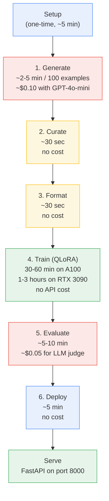

# Getting Started with model-tailor

This guide walks through a complete pipeline run using the included SQL generation task. By the end, you will have generated synthetic training data, fine-tuned an 8B model, evaluated it, and served it locally.

The pipeline consists of six stages. Each stage has a dedicated module under `src/` and a corresponding notebook (`01`-`06`) that provides an interactive walkthrough.

---

## Pipeline Overview



---

## Before You Begin

Refer to the [README](../README.md) for prerequisites (Python 3.10+, CUDA toolkit, API keys).

If you have run `setup.sh` and configured your `.env` file, you are ready to begin.

Quick verification:

Confirm the virtual environment is active:

```bash
which python
```

Expected output should point to `.venv/bin/python` inside the project root.

Confirm GPU availability (required for Step 4 onward):

```bash
python -c "import torch; print(torch.cuda.is_available())"
```

---

## Step 1: Generate Synthetic Data

**What it does:** A teacher LLM (GPT-4o-mini by default) generates natural language to SQL pairs from seed examples. The generator uses multiple strategies (seed expansion, self-instruct) across four difficulty levels to produce a diverse dataset.

**Source module:** `src/generate/` | **Notebook:** `notebooks/01_generate.ipynb`

### Running Generation

Generate 100 examples for a test run:

```python
from src.generate.batch import BatchGenerator, BatchConfig
from src.llm.client import TeacherClient

client = TeacherClient(config_path="config/base.yaml")
config = BatchConfig.from_yaml("config/tasks/sql_generation.yaml")
config.num_examples = 100  # Small run for testing

generator = BatchGenerator(client=client, config=config)
result = generator.run_sync()

print(f"Generated: {result.total_generated}")
print(f"Passed quality check: {result.total_passed_quality}")
print(f"Saved to: {result.output_path}")
```

Alternatively, use the top-level entry point:

```python
from src.generate.batch import run_generation

result = run_generation(config_path="config/tasks/sql_generation.yaml")
```

### Expected Output

- **File:** `data/raw/generated.jsonl`
- **Format:** One JSON object per line with fields `natural_language`, `sql`, `difficulty`, `category`, and `strategy`

### Time and Cost

- Approximately 2-5 minutes for 100 examples
- Approximately $0.10 with GPT-4o-mini, approximately $2.00 with GPT-4o

For details on generation strategies (seed expansion, self-instruct, evol-instruct), see [Generation Strategies](generation-strategies.md).

---

## Step 2: Curate the Dataset

**What it does:** Removes duplicate examples (exact and fuzzy matching), filters out low-quality entries (malformed SQL, queries that are too short or too long), balances the difficulty distribution, and splits the data into train, validation, and test sets.

**Source module:** `src/curate/` | **Notebook:** `notebooks/02_curate.ipynb`

### Running Curation

Curate the generated dataset:

```python
from src.curate import ExactDedup, FuzzyDedup, QualityFilter, DatasetBalancer, DatasetSplitter

# Load raw data
import json
from pathlib import Path

raw_path = Path("data/raw/generated.jsonl")
examples = [json.loads(line) for line in raw_path.read_text().splitlines() if line.strip()]

# Step 2a: Remove exact duplicates
dedup = ExactDedup()
examples = dedup.run(examples)

# Step 2b: Remove near-duplicates (fuzzy matching with 0.85 threshold)
fuzzy = FuzzyDedup(threshold=0.85)
examples = fuzzy.run(examples)

# Step 2c: Filter low-quality examples
quality_filter = QualityFilter(min_length=10, max_length=500)
examples = quality_filter.run(examples)

# Step 2d: Balance difficulty distribution
balancer = DatasetBalancer(
    distribution={"easy": 0.3, "medium": 0.4, "hard": 0.2, "expert": 0.1}
)
examples = balancer.run(examples)

# Step 2e: Split into train / val / test
splitter = DatasetSplitter(ratios=[0.8, 0.1, 0.1], seed=42)
splits = splitter.run(examples)
```

### Expected Output

- `data/curated/train.jsonl` -- training set (80% of data)
- `data/curated/val.jsonl` -- validation set (10%)
- `data/curated/test.jsonl` -- test set (10%)

### Time and Cost

- Approximately 30 seconds, no API cost

---

## Step 3: Format for Training

**What it does:** Converts raw data into the chat template format the target model expects during training. Different model families (Llama, Mistral, Phi) require different prompt formats. This step applies the correct template, adds system prompts, and validates token lengths.

**Source module:** `src/format/` | **Notebook:** `notebooks/03_format.ipynb`

### Running Formatting

Format the curated data for Llama 3.1:

```python
from src.format import ChatTemplate, get_family, validate_max_length

# Select the model family
family = get_family("llama")

# Build the chat template
template = ChatTemplate(family=family)

# Load curated splits
import json
from pathlib import Path

train_data = [json.loads(line) for line in Path("data/curated/train.jsonl").read_text().splitlines() if line.strip()]

# Apply the template to each example
formatted = [template.format(example) for example in train_data]

# Validate token lengths do not exceed model context
results = [validate_max_length(text, max_length=4096) for text in formatted]
```

### Expected Output

- `data/formatted/train.jsonl` -- formatted training data
- `data/formatted/val.jsonl` -- formatted validation data

Each record contains a `text` field with the full chat-template-formatted conversation, ready for the SFTTrainer.

### Time and Cost

- Approximately 30 seconds, no API cost

For supported model families and custom templates, see the `src/format/families.py` module which includes `LlamaFamily`, `MistralFamily`, and `PhiFamily`.

---

## Step 4: Train with QLoRA

**What it does:** Fine-tunes the base model using LoRA adapters -- small trainable layers added on top of the frozen base model. Only the adapter weights are updated during training, which dramatically reduces the number of trainable parameters.

QLoRA quantizes the base model to 4-bit precision, reducing GPU memory from approximately 32 GB to approximately 10 GB, making it possible to fine-tune on a single consumer GPU.

**Source module:** `src/train/` | **Notebook:** `notebooks/04_train.ipynb`

### Requirements

- NVIDIA GPU with at least 10 GB VRAM (RTX 3080 or better recommended)
- CUDA toolkit installed and working (`nvidia-smi` should show your GPU)

### Running Training

Fine-tune Llama 3.1 8B with QLoRA:

```python
from src.train.lora import build_lora_model, LoRAConfig
from src.train.runner import TrainingRunner, TrainingConfig
from datasets import load_dataset

# Load the 4-bit quantized base model with LoRA adapters
lora_config = LoRAConfig(rank=16, alpha=16, load_in_4bit=True)
model, tokenizer = build_lora_model(
    "unsloth/Meta-Llama-3.1-8B-Instruct-bnb-4bit",
    lora_config=lora_config,
)

# Load formatted datasets
train_ds = load_dataset("json", data_files="data/formatted/train.jsonl", split="train")
val_ds = load_dataset("json", data_files="data/formatted/val.jsonl", split="train")

# Configure training
training_config = TrainingConfig.from_yaml("config/base.yaml")

# Run training
runner = TrainingRunner(model, tokenizer, train_ds, val_ds, training_config)
metrics = runner.train()

# Save the LoRA adapter weights
runner.save("models/sql-lora-adapter")
```

### Expected Output

- `models/sql-lora-adapter/` -- directory containing LoRA adapter weights (`adapter_model.safetensors`, `adapter_config.json`) and tokenizer files
- `checkpoints/` -- intermediate checkpoints saved during training

### Monitoring

Training logs are sent to **Weights and Biases** by default. Open your WandB dashboard to monitor loss curves, learning rate schedules, and GPU utilization in real time.

For MLFlow integration and experiment tracking, see [MLFlow Guide](mlflow-guide.md).

### Time and Cost

- Approximately 30-60 minutes on an A100 (80 GB)
- Approximately 1-3 hours on an RTX 3090 (24 GB)
- No API cost (training runs locally on your GPU)

For details on LoRA configuration, gradient checkpointing, and hyperparameter tuning, see [Training Guide](training-guide.md).

---

## Step 5: Evaluate

**What it does:** Measures how well the fine-tuned model performs compared to GPT-4. The evaluation suite includes both automated metrics and LLM-as-judge assessment.

**Key metrics:**

- **Exact match** -- does the generated SQL exactly match the reference?
- **BLEU** -- n-gram overlap between generated and reference SQL
- **Execution accuracy** -- runs both the generated and reference queries against a real database and compares the result sets
- **LLM-as-judge** -- GPT-4o-mini scores each generated query on correctness, efficiency, and style

**Source module:** `src/evaluate/` | **Notebook:** `notebooks/05_evaluate.ipynb`

### Prerequisites

Create the test database from the included schema definitions:

Create the test SQLite database:

```bash
sqlite3 tasks/sql_generation/test.db < tasks/sql_generation/schemas.sql
```

### Running Evaluation

Evaluate the fine-tuned model:

```python
from src.evaluate import exact_match, bleu_score, sql_execution_accuracy, evaluate_batch
from src.evaluate.benchmark import BenchmarkRunner, BenchmarkResults
from src.evaluate.judge import LLMJudge

# Load test data
import json
from pathlib import Path

test_data = [json.loads(line) for line in Path("data/curated/test.jsonl").read_text().splitlines() if line.strip()]

# Run the benchmark
runner = BenchmarkRunner(
    model=model,
    tokenizer=tokenizer,
    test_data=test_data,
    db_path="tasks/sql_generation/test.db",
)
results = runner.run()

# Print aggregate scores
print(f"Exact Match:         {results.metric_scores.get('exact_match', 0):.2%}")
print(f"BLEU:                {results.metric_scores.get('bleu', 0):.4f}")
print(f"Execution Accuracy:  {results.metric_scores.get('execution_accuracy', 0):.2%}")

# Optional: LLM-as-judge evaluation
judge = LLMJudge(model="gpt-4o-mini")
judge_results = judge.evaluate(results.predictions, results.targets)
```

### Expected Output

A `BenchmarkResults` object containing per-metric scores, breakdowns by category (SELECT, JOIN, subquery, etc.) and by difficulty level (easy, medium, hard, expert).

### Time and Cost

- Approximately 5-10 minutes for a typical test set
- Approximately $0.05 for the LLM-as-judge step (uses GPT-4o-mini)

For metric definitions and custom evaluation pipelines, see [Evaluation Guide](evaluation-guide.md).

---

## Step 6: Deploy and Serve

**What it does:** Exports the fine-tuned model to an efficient inference format (GGUF) and starts a FastAPI server that exposes a REST API for SQL generation.

**Source module:** `src/deploy/` | **Notebook:** `notebooks/06_deploy.ipynb`

### Export to GGUF

GGUF is a compact binary format used by llama.cpp and Ollama. Quantization compresses the model further for fast inference with minimal quality loss.

Export and quantize the model:

```python
from src.deploy import merge_and_export, quantize_gguf

# Merge LoRA adapters into the base model and export as GGUF
output_path = merge_and_export(
    model=model,
    tokenizer=tokenizer,
    output_dir="models/sql-model-gguf",
    format="gguf",
    gguf_quant="q4_k_m",  # 4-bit quantization, good balance of size and quality
)

print(f"Exported to: {output_path}")
```

Available quantization methods:

| Method   | Bits per Weight | Approximate Size (8B model) | Quality    |
|----------|----------------:|----------------------------:|------------|
| `f16`    |           16.00 |                      ~16 GB | Baseline   |
| `q8_0`   |            8.50 |                       ~8 GB | Near-lossless |
| `q5_k_m` |            5.69 |                       ~6 GB | Very good  |
| `q4_k_m` |            4.83 |                       ~5 GB | Good       |

### Start the Inference Server

Start the FastAPI server:

```bash
MODEL_PATH=models/sql-model-gguf MODEL_TYPE=gguf uvicorn src.deploy.serve:app --host 0.0.0.0 --port 8000
```

Or programmatically:

```python
from src.deploy.serve import create_app

app = create_app("models/sql-model-gguf/model-q4_k_m.gguf", model_type="gguf")
```

### Test the Endpoint

Verify the server is healthy:

```bash
curl http://localhost:8000/health
```

Send a SQL generation request:

```bash
curl -X POST http://localhost:8000/generate_sql \
  -H "Content-Type: application/json" \
  -d '{
    "question": "How many orders were placed last month?",
    "schema": "CREATE TABLE orders (id INT, created_at DATE, total DECIMAL);",
    "max_tokens": 256
  }'
```

Expected response:

```json
{
  "sql": "SELECT COUNT(*) FROM orders WHERE created_at >= DATE('now', '-1 month');",
  "tokens_generated": 24,
  "elapsed_seconds": 0.15
}
```

For production deployment, model Hub publishing, and Ollama integration, see [Deployment Guide](deployment-guide.md).

---

## Docker Deployment

For reproducible deployments without managing Python environments, use Docker Compose. The provided configuration starts an inference server and an MLFlow tracking UI.

### Prerequisites

- Docker and Docker Compose
- NVIDIA Container Toolkit (required for GPU passthrough)

### Install NVIDIA Container Toolkit

Install NVIDIA Container Toolkit on Ubuntu/Debian:

```bash
distribution=$(. /etc/os-release;echo $ID$VERSION_ID)
```

```bash
curl -fsSL https://nvidia.github.io/libnvidia-container/gpgkey | sudo gpg --dearmor -o /usr/share/keyrings/nvidia-container-toolkit-keyring.gpg
```

```bash
curl -s -L https://nvidia.github.io/libnvidia-container/$distribution/libnvidia-container.list | sed 's#deb https://#deb [signed-by=/usr/share/keyrings/nvidia-container-toolkit-keyring.gpg] https://#g' | sudo tee /etc/apt/sources.list.d/nvidia-container-toolkit.list
```

```bash
sudo apt-get update && sudo apt-get install -y nvidia-container-toolkit
```

```bash
sudo nvidia-ctk runtime configure --runtime=docker && sudo systemctl restart docker
```

### Start Services

Start inference server (port 8000) and MLFlow UI (port 5000):

```bash
docker-compose up --build
```

Start MLFlow UI only:

```bash
docker-compose up mlflow
```

### Verify

Check the inference server:

```bash
curl http://localhost:8000/health
```

Open the MLFlow UI in your browser:

```
http://localhost:5000
```

### Volume Mounts

The Docker Compose configuration mounts three directories from your host into the containers:

| Host Directory | Container Path     | Purpose                          |
|----------------|--------------------|----------------------------------|
| `./models/`    | `/app/models`      | Exported model weights           |
| `./data/`      | `/app/data`        | Training and evaluation datasets |
| `./mlruns/`    | `/mlflow/mlruns`   | MLFlow experiment tracking data  |

This means your trained models, datasets, and experiment logs persist on the host filesystem and survive container restarts.

---

## Troubleshooting

### No GPU Detected / CUDA Not Available

`torch.cuda.is_available()` returns `False`.

1. Verify NVIDIA drivers are installed:

    Check NVIDIA driver and GPU status:

    ```bash
    nvidia-smi
    ```

2. If `nvidia-smi` is not found, install the drivers for your distribution.
3. For WSL2, ensure GPU passthrough is enabled. The Windows NVIDIA driver handles this automatically for recent driver versions (525+). Restart WSL if needed:

    Restart WSL from PowerShell:

    ```powershell
    wsl --shutdown
    ```

4. Verify PyTorch sees your GPU:

    Check PyTorch CUDA availability:

    ```bash
    python -c "import torch; print(torch.cuda.get_device_name(0))"
    ```

### OPENAI_API_KEY Not Set

The teacher client raises an error about missing API keys.

1. Confirm your `.env` file exists in the project root and contains the key.
2. Verify the key is loaded:

    Check that the key is present in the environment:

    ```bash
    cat .env | grep OPENAI
    ```

3. If the key is present in `.env` but not in the environment, ensure your activation script sources it. The `setup.sh` script configures this automatically.

### ModuleNotFoundError

Python cannot find `src` or any project module.

1. Confirm the virtual environment is active:

    Check which Python is in use:

    ```bash
    which python
    ```

    This should point to `.venv/bin/python` inside the project root.

2. If not active, activate it manually:

    Activate the virtual environment:

    ```bash
    source .venv/bin/activate
    ```

3. If the module is still not found, reinstall the project in editable mode:

    Reinstall the project:

    ```bash
    pip install -e .
    ```

### CUDA Out of Memory

Training crashes with `torch.cuda.OutOfMemoryError`.

1. Reduce the batch size in `config/base.yaml`:

    ```yaml
    defaults:
      batch_size: 2  # Reduce from 4
    ```

2. Enable gradient checkpointing (enabled by default with Unsloth):

    ```python
    lora_config = LoRAConfig(use_gradient_checkpointing="unsloth")
    ```

3. Check current VRAM usage before training:

    Check GPU memory usage:

    ```bash
    nvidia-smi
    ```

4. Close other GPU-consuming processes (other notebooks, browsers using hardware acceleration, etc.).

### Connection Refused (Ollama)

The teacher client cannot reach Ollama at `localhost:11434`.

1. Confirm Ollama is installed and running:

    Check Ollama status:

    ```bash
    ollama list
    ```

2. If Ollama is not running, start it and pull the required model. For setup instructions, see [Ollama Setup](ollama-setup.md).

### Connection Refused (MLFlow)

The MLFlow tracking server is not reachable at `localhost:5000`.

1. Start the MLFlow server manually:

    Start the MLFlow tracking server:

    ```bash
    mlflow server --host 0.0.0.0 --port 5000
    ```

2. Or start it via Docker Compose:

    Start the MLFlow service:

    ```bash
    docker-compose up mlflow
    ```

3. For detailed configuration, see [MLFlow Guide](mlflow-guide.md).

### ruff check Fails

Code quality checks fail during CI or pre-commit.

1. Auto-fix formatting and lint issues:

    Run the formatter:

    ```bash
    make format
    ```

2. Then re-run the checks:

    Run all checks:

    ```bash
    make check
    ```

3. Some issues (unused imports, type errors) require manual fixes. Read the `ruff` output for specific file and line references.

### Auto-venv Not Activating on cd

The virtual environment should activate automatically when you enter the project directory in WSL.

1. Restart your terminal or reload the shell configuration:

    Reload bash configuration:

    ```bash
    source ~/.bashrc
    ```

2. If the issue persists, re-run the setup script:

    Re-run setup:

    ```bash
    chmod +x setup.sh && ./setup.sh
    ```

---

## What to Read Next

- [Architecture](architecture.md) -- how the modules connect and the data flows between stages
- [Configuration](configuration.md) -- all YAML options and how to customize them
- [Generation Strategies](generation-strategies.md) -- seed expansion, self-instruct, and evol-instruct in depth
- [Training Guide](training-guide.md) -- LoRA hyperparameters, multi-GPU, and troubleshooting training runs
- [Evaluation Guide](evaluation-guide.md) -- metric definitions and custom evaluation pipelines
- [Deployment Guide](deployment-guide.md) -- production serving, Ollama, and HuggingFace Hub
- [Adding Tasks](adding-tasks.md) -- how to add new tasks beyond SQL generation
