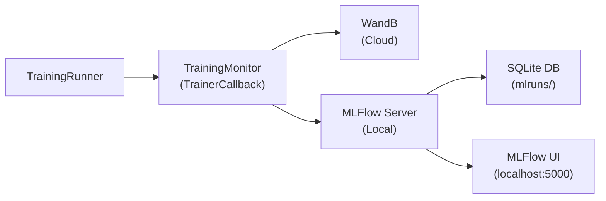
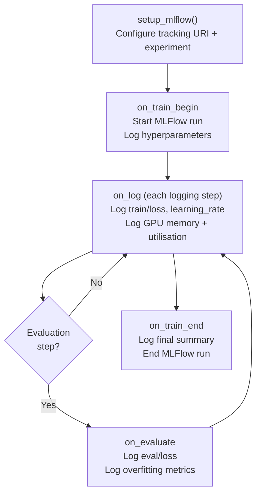

# MLFlow Guide

## What is MLFlow

MLFlow is an open-source experiment tracking tool that records hyperparameters, metrics, and artifacts for machine learning runs. model-tailor logs training metrics to both WandB and MLFlow simultaneously during every fine-tuning run. While WandB provides rich cloud-hosted dashboards, MLFlow gives you a local web UI for comparing runs, inspecting metric curves, and reviewing hyperparameters -- all without needing an external account or internet connection.

## Data Flow

The following diagram shows how training metrics flow from the training loop to both tracking backends.



## Starting the MLFlow Server

### Option A: Standalone

Run the MLFlow server directly from the command line. This stores all data in a local SQLite database under `mlruns/`.

Standalone MLFlow server:

```bash
mlflow server --host 0.0.0.0 --port 5000 --backend-store-uri sqlite:///mlruns/mlflow.db --default-artifact-root mlruns
```

### Option B: Docker Compose

If you prefer running MLFlow in a container, the project includes an MLFlow service in `docker-compose.yaml`.

Start MLFlow via Docker Compose:

```bash
docker-compose up mlflow
```

### Verify the Server

Open [http://localhost:5000](http://localhost:5000) in your browser. You should see the MLFlow Experiments page with a Default experiment listed.

Ensure the `MLFLOW_TRACKING_URI` in your `.env` file matches the server address (default: `http://localhost:5000`). The `setup_mlflow()` function reads this value from `config/base.yaml` first, then falls back to the `MLFLOW_TRACKING_URI` environment variable.

## Configuration

The MLFlow settings live in the `mlflow` section of `config/base.yaml`.

MLFlow configuration in config/base.yaml:

```yaml
mlflow:
  tracking_uri: http://localhost:5000
  experiment_name: model-tailor
```

| Key | Description | Default |
|-----|-------------|---------|
| `tracking_uri` | URL of the MLFlow tracking server. Set this to wherever your MLFlow instance is running. | `http://localhost:5000` |
| `experiment_name` | The experiment name under which all runs are grouped. Each experiment appears as a folder in the MLFlow UI. | `model-tailor` |

If `config/base.yaml` is not found or the `mlflow` section is missing, the integration falls back to the `MLFLOW_TRACKING_URI` environment variable and the experiment name `model-tailor`.

## How model-tailor Integrates

The MLFlow integration lives in `src/train/monitor.py` and is fully automatic. No code changes are needed to enable it.



The integration works as follows:

1. **Before training**: `setup_mlflow()` is called to configure the tracking URI and experiment name from `config/base.yaml`. This sets the MLFlow context for the upcoming run.

2. **At training start**: The `TrainingMonitor` callback's `on_train_begin` method creates a new MLFlow run and logs all hyperparameters -- learning rate, number of epochs, batch size, gradient accumulation steps, warmup ratio, weight decay, and the learning rate scheduler type.

3. **During training**: At each logging step, `on_log` sends the current training loss, learning rate, and GPU statistics (memory allocated, memory reserved, GPU utilisation) to MLFlow.

4. **At evaluation**: `on_evaluate` logs the validation loss and an overfitting gap metric to MLFlow. If the gap between validation and training loss exceeds a configurable threshold, an overfitting flag is logged.

5. **At training end**: `on_train_end` logs a final summary (final train/eval loss, total data points, overfitting status) and ends the MLFlow run.

All MLFlow calls are wrapped in `try/except` blocks, so the training pipeline runs without interruption even if the MLFlow server is unavailable or the `mlflow` package is not installed.

Reference: `src/train/monitor.py`

## Using the MLFlow UI

After running at least one training session, open the MLFlow UI at [http://localhost:5000](http://localhost:5000) to explore your results.

### Experiments Page

The landing page lists all experiments. Click an experiment name (e.g., `model-tailor`) to see the runs within it. Each run corresponds to one training session.

### Run List

The run list shows all runs in the selected experiment. Each row displays the run name, start time, duration, and key metrics. Click any column header to sort -- for example, sort by `eval/loss` ascending to find your best-performing run.

### Run Comparison

Select two or more runs using the checkboxes on the left, then click **Compare**. The comparison view shows:

- **Metric charts**: Side-by-side line plots for each logged metric across the selected runs.
- **Parameters table**: A table listing every hyperparameter, highlighting differences between runs.

This is the fastest way to understand how a hyperparameter change (e.g., increasing LoRA rank from 16 to 32) affected training loss.

### Metric Charts

Click any individual metric name (e.g., `train/loss`) within a run to see its full curve plotted over training steps. This is useful for spotting issues like loss spikes, divergence, or early convergence.

### Parameters Table

Each run's detail page includes a Parameters section listing every hyperparameter logged at the start of training. Use this to recall the exact configuration of a past run without searching through config files or logs.

## MLFlow vs WandB

| Feature | MLFlow | WandB |
|---------|--------|-------|
| Hosting | Local (self-hosted) | Cloud (free tier available) |
| Setup | No account needed | Requires API key |
| Dashboards | Basic charts | Rich interactive dashboards |
| Model Registry | Built-in | Available |
| Cost | Free | Free tier, paid for teams |

model-tailor logs to both simultaneously. Use MLFlow for quick local comparisons and offline development, and WandB for detailed analysis, team sharing, and production monitoring.
