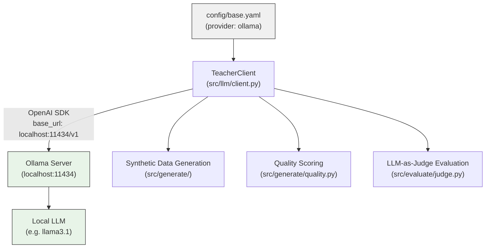
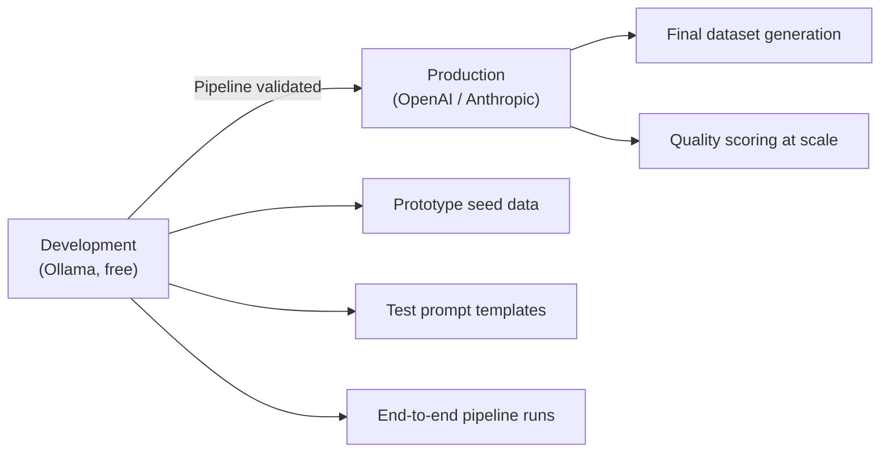

# Ollama Setup Guide

## What is Ollama

Ollama is an open-source tool that runs large language models locally on your machine with no external API calls and zero cost. model-tailor supports Ollama as one of its three teacher model providers alongside OpenAI and Anthropic. By pointing the `TeacherClient` at a local Ollama server, you can run the entire synthetic data generation, quality scoring, and evaluation pipeline without spending anything on API credits. The trade-off is that local models produce lower-quality outputs than GPT-4 or Claude, so Ollama is best suited for prototyping and experimentation before committing to paid API calls for production-quality datasets.

---

## Architecture Overview

The following diagram shows how Ollama integrates into the model-tailor pipeline. The `TeacherClient` reads the provider setting from `config/base.yaml` and connects to the local Ollama server over its OpenAI-compatible API endpoint.



---

## Install Ollama

### Linux / WSL

Run the official installer script:

```bash
curl -fsSL https://ollama.com/install.sh | sh
```

### Verify Installation

Confirm that Ollama is installed and available on your PATH:

```bash
ollama --version
```

---

## Pull a Model

Before using Ollama with model-tailor, you need to download at least one model. The `ollama pull` command fetches model weights and stores them locally.

### Pull the Recommended Default

```bash
ollama pull llama3.1
```

### Recommended Models

The table below lists models that work well with model-tailor. Choose based on your available hardware and task requirements.

| Model | Parameters | RAM Required | Quality | Best For |
|-------|-----------|-------------|---------|----------|
| llama3.1 | 8B | ~6 GB | Good | Prototyping, simple tasks |
| llama3.1:70b | 70B | ~40 GB | High | Near-GPT-4 quality |
| mistral | 7B | ~5 GB | Good | Fast iteration |
| codellama | 7B | ~5 GB | Good (code) | Code-heavy tasks like SQL |
| deepseek-coder-v2 | 16B | ~10 GB | High (code) | Best local option for SQL |

To pull any of these models, replace the model name in the command:

```bash
ollama pull deepseek-coder-v2
```

---

## Start the Server

On many Linux systems, Ollama starts automatically as a systemd service after installation. If the server is not already running, start it manually.

### Start Ollama

```bash
ollama serve
```

### Verify the Server is Running

Send a request to the API tags endpoint to confirm the server responds:

```bash
curl http://localhost:11434/api/tags
```

A successful response returns a JSON object listing your downloaded models.

---

## Configure model-tailor

To switch model-tailor from OpenAI to Ollama, update the `teacher` section in `config/base.yaml`.

### Update config/base.yaml

```yaml
teacher:
  provider: ollama
  model: llama3.1
  temperature: 0.7
  max_tokens: 2048
  ollama_base_url: http://localhost:11434
```

No API key is required. The `TeacherClient` connects using the OpenAI SDK with `api_key="ollama"` as a placeholder, since Ollama does not perform authentication.

The `ollama_base_url` defaults to `http://localhost:11434`. If you are running Ollama on a different machine or port, override this value either in `config/base.yaml` or by setting the environment variable in your `.env` file:

### Override the Base URL (optional)

```
OLLAMA_BASE_URL=http://192.168.1.100:11434
```

The client resolves the URL with the following priority: `config/base.yaml` value > `OLLAMA_BASE_URL` environment variable > hardcoded default (`http://localhost:11434`).

---

## Quality Expectations

Local models are less capable than cloud-hosted frontier models. Understanding these limitations helps you allocate resources effectively.

**llama3.1 (8B)** -- Expect 10-20% lower quality than GPT-4o-mini on complex SQL generation. Handles simple SELECT and JOIN queries well but may struggle with window functions, common table expressions (CTEs), and multi-step subqueries.

**llama3.1:70b (70B)** -- Comparable to GPT-4o-mini for most SQL tasks. The quality gap narrows significantly at this scale, but the model requires substantial RAM (approximately 40 GB).

**codellama / deepseek-coder-v2** -- Code-specialized models outperform general-purpose models of similar size on SQL generation. If your task is code-heavy, prefer these over llama3.1 at the same parameter count.

### Recommended Workflow

Use Ollama for the first few iterations of your pipeline: generating seed data, testing prompt templates, verifying that the generation-curation-formatting chain works end-to-end, and running quick evaluation loops. This keeps API costs at zero during development.

When you are satisfied with the pipeline structure and ready to produce a production-quality dataset, switch the provider to OpenAI or Anthropic in `config/base.yaml`. This approach concentrates paid API spend on the final dataset where quality matters most.



---

## GPU and Memory Considerations

Ollama automatically detects and uses a CUDA-compatible GPU when one is available. No manual configuration is needed.

**8B models** -- Require approximately 6 GB of VRAM (GPU) or RAM (CPU fallback). Most modern GPUs with 8 GB or more VRAM handle these comfortably.

**70B models** -- Require approximately 40 GB of memory. A high-end GPU (e.g. A100 80 GB) can run these entirely in VRAM. On consumer hardware, Ollama offloads layers to system RAM automatically, but inference speed drops significantly.

**Shared GPU resources** -- If both Ollama (for data generation) and Unsloth (for fine-tuning) need the same GPU, do not run them simultaneously. Run all generation and evaluation steps first with Ollama, then stop the Ollama server and begin training. Competing for VRAM leads to out-of-memory errors or severe slowdowns.

### Stop Ollama Before Training

```bash
systemctl stop ollama
```

Or if you started it manually, terminate the `ollama serve` process before launching training.

---

## WSL2 Considerations

For Windows users running model-tailor inside WSL2, there are two approaches to running Ollama.

### Option A: Install on Windows (Recommended)

Install Ollama on the Windows side using the installer from [ollama.com](https://ollama.com). This provides the best GPU support because the Windows Ollama binary accesses the GPU driver directly. The server is accessible from inside WSL at `localhost:11434` by default, so no additional configuration is needed in model-tailor.

### Option B: Install Inside WSL

If you prefer to keep everything inside WSL, install Ollama using the Linux instructions above. This requires that CUDA is properly configured inside your WSL2 environment.

Verify GPU access inside WSL before proceeding:

```bash
nvidia-smi
```

If `nvidia-smi` does not show your GPU, the CUDA drivers are not properly forwarded into WSL. In that case, use Option A instead.

### Non-Default Address

If Ollama runs on the Windows host and is not reachable at `localhost:11434` from WSL (uncommon but possible with custom networking), set the correct address in your `.env` file:

```
OLLAMA_BASE_URL=http://<windows-host-ip>:11434
```
