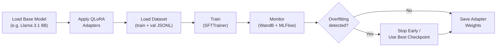

# Training Guide

## Overview

model-tailor uses **QLoRA** (Quantized Low-Rank Adaptation) to fine-tune large language models on a single consumer or cloud GPU. The training module (`src/train/`) wraps Unsloth and HuggingFace TRL to make this straightforward.



## What is LoRA?

Instead of updating all model parameters (billions of weights), LoRA freezes the base model and injects small trainable matrices into each layer. These "adapter" matrices have much fewer parameters.

```
Full fine-tuning:  Update all 8B parameters     → 32 GB VRAM
LoRA:              Update ~20M adapter params    → 16 GB VRAM
QLoRA:             LoRA + 4-bit base model       → 8-12 GB VRAM
```

### How LoRA Works

For a weight matrix W (e.g., attention projection), LoRA adds two small matrices:

```
W_new = W_frozen + (A × B)

Where:
  W_frozen: Original weight matrix (e.g., 4096 × 4096) — not updated
  A: Low-rank matrix (4096 × 16) — trainable
  B: Low-rank matrix (16 × 4096) — trainable
  rank = 16 (configurable)
```

Only A and B are trained. This reduces trainable parameters from 16M to 131K per layer.

### QLoRA Addition

QLoRA quantizes the frozen base model to 4-bit precision, cutting memory usage in half again. The adapter matrices (A, B) stay in full precision for training stability.

## Configuration

### LoRA Hyperparameters

Set in `config/base.yaml` under `defaults`:

```yaml
defaults:
  lora_rank: 16       # Rank of the low-rank matrices (higher = more capacity, more VRAM)
  lora_alpha: 16      # Scaling factor (typically equal to rank)
```

Detailed config via `src/train/lora.py::LoRAConfig`:

| Parameter | Default | Description |
|-----------|---------|-------------|
| `rank` | 16 | Low-rank dimension. 8 for simple tasks, 16 for moderate, 32 for complex |
| `alpha` | 16 | Scaling factor. Rule of thumb: set equal to rank |
| `dropout` | 0.0 | LoRA dropout. Unsloth recommends 0.0 |
| `target_modules` | All projections | Which layers get LoRA adapters |
| `use_gradient_checkpointing` | `"unsloth"` | Unsloth's optimized gradient checkpointing |
| `max_seq_length` | 4096 | Maximum sequence length for training |
| `load_in_4bit` | `true` | Enable 4-bit quantization (QLoRA) |

### Target Modules by Model Family

| Family | Target Modules |
|--------|---------------|
| Llama | `q_proj`, `k_proj`, `v_proj`, `o_proj`, `gate_proj`, `up_proj`, `down_proj` |
| Mistral | `q_proj`, `k_proj`, `v_proj`, `o_proj`, `gate_proj`, `up_proj`, `down_proj` |
| Phi | `q_proj`, `k_proj`, `v_proj`, `dense`, `fc1`, `fc2` |

### Training Hyperparameters

```yaml
defaults:
  batch_size: 4            # Per-device batch size
  num_epochs: 3            # Training epochs
  learning_rate: 2.0e-4    # Peak learning rate
```

Additional parameters in `src/train/runner.py::TrainingConfig`:

| Parameter | Default | Description |
|-----------|---------|-------------|
| `learning_rate` | 2e-4 | Peak learning rate |
| `weight_decay` | 0.01 | L2 regularization |
| `warmup_ratio` | 0.03 | Fraction of steps for warmup |
| `lr_scheduler` | `cosine` | Learning rate schedule |
| `batch_size` | 4 | Per-device batch size |
| `gradient_accumulation` | 4 | Effective batch size = batch_size × gradient_accumulation |
| `num_epochs` | 3 | Total training epochs |
| `bf16` | `true` | Use bfloat16 mixed precision |

## Usage

### Basic Training

```python
from src.train import build_lora_model, get_default_config, TrainingRunner

# 1. Load base model with QLoRA adapters
lora_config = get_default_config('llama')
model, tokenizer = build_lora_model(
    'unsloth/Meta-Llama-3.1-8B-Instruct-bnb-4bit',
    lora_config
)

# 2. Load datasets
from datasets import load_dataset
dataset = load_dataset('json', data_files={
    'train': 'data/formatted/train.jsonl',
    'validation': 'data/formatted/val.jsonl'
})

# 3. Train
runner = TrainingRunner(
    model=model,
    tokenizer=tokenizer,
    train_dataset=dataset['train'],
    val_dataset=dataset['validation'],
)
metrics = runner.train()

# 4. Save adapter weights
runner.save('models/sql-llama-8b-lora')
```

### Resume from Checkpoint

```python
metrics = runner.train(resume_from_checkpoint=True)  # Auto-detect latest
# or
metrics = runner.train(resume_from_checkpoint='checkpoints/checkpoint-500')
```

## GPU Requirements

| Model Size | Quantization | Min VRAM | Recommended GPU |
|-----------|-------------|----------|----------------|
| 7-8B | QLoRA (4-bit) | 10 GB | RTX 4090, A100 40GB |
| 7-8B | LoRA (16-bit) | 24 GB | A100 40GB, H100 |
| 13B | QLoRA (4-bit) | 20 GB | A100 40GB |
| 13B | LoRA (16-bit) | 48 GB | A100 80GB, H100 |

### Cloud GPU Options

| Provider | GPU | VRAM | Cost/hr (approx) |
|----------|-----|------|-------------------|
| RunPod | A100 40GB | 40 GB | $1.50 |
| RunPod | H100 80GB | 80 GB | $3.50 |
| Lambda Labs | A100 40GB | 40 GB | $1.25 |
| Lambda Labs | H100 80GB | 80 GB | $2.49 |

## Monitoring

Training metrics are logged to both **Weights & Biases** and **MLFlow** via `src/train/monitor.py::TrainingMonitor`:

- **Loss curves**: Training and validation loss per step
- **Learning rate**: Current LR over time
- **GPU stats**: VRAM usage and utilization
- **Overfitting detection**: Alerts when val loss diverges from train loss

Both tracking systems receive the same metrics simultaneously. WandB provides rich cloud dashboards while MLFlow runs locally with no account required. See the [MLFlow Guide](mlflow-guide.md) for setup and usage instructions.

```python
from src.train import plot_loss_curve

# Plot from a completed WandB run
plot_loss_curve('your-entity/model-tailor/run-id', output_file='loss.png')
```

### Overfitting Rules of Thumb

| Train/Val Gap | Status | Action |
|--------------|--------|--------|
| < 0.1 | Healthy | Continue training |
| 0.1 - 0.3 | Mild overfitting | Probably fine, monitor closely |
| > 0.3 | Significant | Stop training, add more data or reduce epochs |
| Val loss increasing | Severe | Stop immediately, use earlier checkpoint |

## Tips

1. **Start with the defaults.** The config in `base.yaml` works well for most 8B model fine-tunes on 3,000-5,000 examples.

2. **Watch epoch 2-3.** Most overfitting starts here. If val loss increases after epoch 2, the epoch 2 checkpoint is your best model.

3. **Effective batch size matters.** `batch_size=4` with `gradient_accumulation=4` gives an effective batch size of 16. Increase gradient accumulation if you can't increase batch size due to VRAM limits.

4. **Unsloth is 2x faster.** Unsloth's optimized kernels typically give 2x training speedup over vanilla HuggingFace + PEFT. It also uses less VRAM.

5. **Don't over-train.** For 5,000 examples, 3 epochs is usually enough. More data is almost always better than more epochs.
